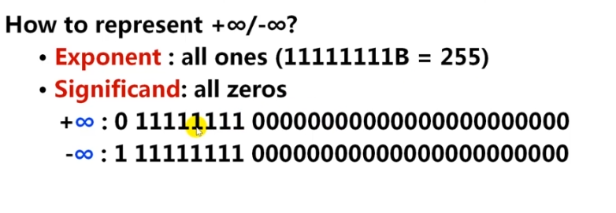

---

---

### csapp - lab1

#### 1.bitXor

用～（取补）和&实现异或操作

#### 2.tmin

两字节补码的最小数

0111 1111 1111 1111 1111 1111 1111 1111 最大的，～x + 1，取负，负数比正数小一个

1000 0000 0000 0000 0000 0000 0000 0000 == 0x80000000 

太大了，用移位

#### 3.isTmax

如果x是最大值，返回1，否则返回0

* 最大值，符号位是0，其他是1，所以+1后，符号位是1，其他是0，相异或，全1,全1的反是0，0取非是1（判断是否是-1的方法）
* 除了最大值，-1也有同样的情况

排除：+1后，最大值是变成另一个数，而-1是0，根据这个排除掉-1

#### 4.allOddBits

如果奇数位都是1，返回1，否则，返回0

让x与0xAAAAAAAA相与，如果奇数位都是1，结果是0xAAAAAAAA，再异或就是0了，否则就非0

#### 5.negate

实现取反

-x = ~x + 1

#### 6.isAsciiDigit

如果 0x30 <= x <= 0x39 ，返回1，否则，返回0

将x与两数相减（x - y ==  x + （～y + 1） ），判断符号位（通过右移），第一个为正，第二个为负

#### 7.conditional

有三个参数，x、y、z，如果x非0，返回y，否则，返回z

判断x是否非零：!!x

返回一个数：变成1，然后～x + 1变成-1（全1），然后相与

#### 8.isLessOrEqual

三种情况

* 符号相反，如果y为正数，为1
* 符号相同，相减 > 0为1
* 两数相等（异或实现），返回1

#### 9.logicalNeg

实现取非运算，零返回1，其他返回0

正负零的符号位都是0

取反与1&，正负再&

####　10.howManyBits

求共有多少位，最高位+1

特殊情况

* 0 : 1
* 1 : 1

正数：最高位1的位置 + 1（符号位）

负数：求反码，同正数

具体采用二分，32分成16，看高位16是否为0，非0，说明至少有16 + 1（前面的数）+ 1 （符号位），接着再8、4、2、1下去

#### 11.floatScale2

实现乘2功能。（内部使用的单精度浮点型）

特殊情况

* NaN：直接将参数返回回去
* 区别规格化数和非规格化数

单精度浮点内部

NaN

正负无穷

#### 12.floatFloat2Int

参数的类型是unsigned，是浮点数的机器数，将其转换为该浮点数转换的int值。

情况：

* 指数部分为为负，说明一定是零点几，直接返0

* 如果大于31，大了，直接返回0x80000000u

* 在里面，先让尾数部分加上默认的1，然后看指数是否能把所有的尾数变整

  * E < 23，说明后面还有小数部分
  * E > 23，说明尾数都完整整数，还可以继续乘2^(E-23)

  最后，根据符号位，返回对应符号的frac

#### 13.floatPower2

2^x（x是参数），求该值float的机器数

分别判断0和无穷大的情况，然后将阶码左移23位即可。

23是因为，阶码部分，就是尾数（23位）前面，有个默认的1

E = x;

0 | bios + E | 23个0

---

