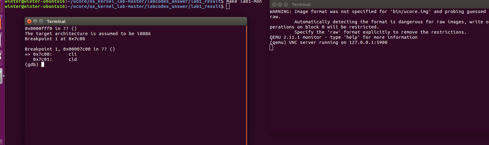
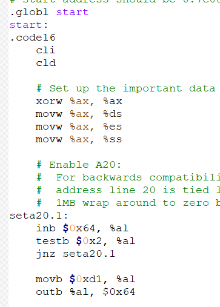
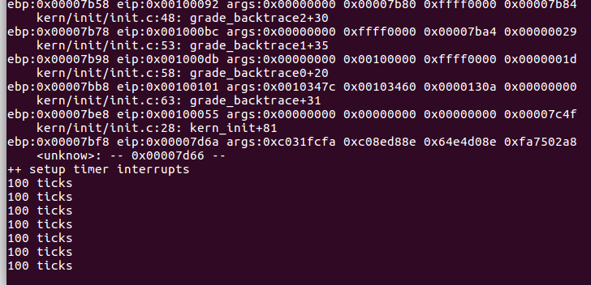

### 练习1

1. 操作系统镜像文件`ucore.img`是如何一步一步生成的？(需要比较详细地解释Makefile中每一条相关命令和命令参数的含义，以及说明命令导致的结果)

首先，`make clean`一下，然后执行`make V=`执行，查看make执行的命令

通过`gcc`把C的源代码编译成了.o的目标文件

```
gcc -Iboot/ -march=i686 -fno-builtin -fno-PIC -Wall -ggdb -m32 -gstabs -nostdinc  -fno-stack-protector -Ilibs/ -Os -nostdinc -c boot/bootmain.c -o obj/boot/bootmain.o
```

然后通过`ld`命令把这些目标文件转换成一个执行程序（如`bootbolck.out`实际上是`bootloader`的一个执行程序）

```
ld -m    elf_i386 -nostdlib -N -e start -Ttext 0x7C00 obj/boot/bootasm.o obj/boot/bootmain.o -o obj/bootblock.o
'obj/bootblock.out' size: 484 bytes
build 512 bytes boot sector: 'bin/bootblock' success!
```

最后用`dd`命令可以把`bootloader`放到一个虚拟的硬盘里面`ucore.img`

```
dd if=/dev/zero of=bin/ucore.img count=10000
10000+0 records in
10000+0 records out
5120000 bytes (5.1 MB, 4.9 MiB) copied, 0.0145188 s, 353 MB/s
```

最后，我们`qemu`就会给予这个虚拟硬盘中的数据来执行相应的这个代码


1. 一个被系统认为是符合规范的硬盘主引导扇区的特征是什么？

需要查看`/tools/sign.c`文件

第一点，最后以`0x55AA`结尾

```
char buf[512];
 [...]
buf[510] = 0x55;
buf[511] = 0xAA;
```

第二点，大小为512字节

```
    FILE *ofp = fopen(argv[2], "wb+");
    size = fwrite(buf, 1, 512, ofp);
    if (size != 512) {
        fprintf(stderr, "write '%s' error, size is %d.\n", argv[2], size);
        return -1;
    }
```


### 练习2

根据提示，在Makefile里面看一下`lab1-mon`是什么东西

```
lab1-mon: $(UCOREIMG)
	$(V)$(TERMINAL) -e "$(QEMU) -S -s -d in_asm -D $(BINDIR)/q.log -monitor stdio -hda $< -serial null"
	$(V)sleep 2
	$(V)$(TERMINAL) -e "gdb -q -x tools/lab1init"
```

`lab1-mon`大概做了两件事

第一个是让`qemu`把它执行的指令给记录下来，把log信息给记录下来，放到`q.log`

第二个是和我们的`GDB`结合，来调试正在执行的`Bootloader`


`gdb -q -x tools/lab1init`：

-q：安静模式，不打印介绍信息和版本信息；
-x：从指定文件中执行`GDB`指令；


查看`lab1init`

```
file bin/kernel				#加载符号信息
target remote :1234			#与qemu进行连接
set architecture i8086
b *0x7c00					#在0x7c00处下断点
continue
x /2i $pc					#查看两条指令 
```


执行`make lab1-mon`启动




查看10条指令

```
(gdb) x/10i $pc
=> 0x7c00:	cli    
   0x7c01:	cld    
   0x7c02:	xor    %eax,%eax
   0x7c04:	mov    %eax,%ds
   0x7c06:	mov    %eax,%es
   0x7c08:	mov    %eax,%ss
   0x7c0a:	in     $0x64,%al
   0x7c0c:	test   $0x2,%al
   0x7c0e:	jne    0x7c0a
   0x7c10:	mov    $0xd1,%al
```

与`bootasm.S`里的内容是一样的



### 练习3

请分析`bootloader`是如何完成从实模式进入保护模式的。

需要了解：

（1）为何开启`A20`，以及如何开启`A20`

`A20`功能：

8086的可寻址空间和可表达的物理地址不匹配，如果超过`1MB`，发生回卷。

80286提供保护模式，不需要回卷。

为了保持一致性，加一个硬件逻辑，模仿以上的回绕特征。

开启`A20`：

1. 等待8042 Input buffer为空；
2. 发送Write 8042 Output Port （`P2`）命令到8042 Input buffer；
3. 等待8042 Input buffer为空；
4. 将8042 Output Port（`P2`）得到字节的第2位置1，然后写入8042 Input buffer；

```
    # Enable A20:
    #  For backwards compatibility with the earliest PCs, physical
    #  address line 20 is tied low, so that addresses higher than
    #  1MB wrap around to zero by default. This code undoes this.
	#启用A20：
	#由于需要兼容早期pc，物理地址的第20位绑定为0，所以高于1MB的地址又回到了0x00000.

seta20.1:
    inb $0x64, %al                                  # Wait for not busy(8042 input buffer empty).
    testb $0x2, %al
    jnz seta20.1

    movb $0xd1, %al                                 # 0xd1 -> port 0x64
    outb %al, $0x64                                 # 0xd1 means: write data to 8042's P2 port

seta20.2:
    inb $0x64, %al                                  # Wait for not busy(8042 input buffer empty).
    testb $0x2, %al
    jnz seta20.2

    movb $0xdf, %al                                 # 0xdf -> port 0x60
    outb %al, $0x60                                 # 0xdf = 11011111, means set P2's A20 bit(the 1 bit) to 1

```

由于历史原因`A20`地址位由键盘控制器芯片8042管理。所以要给8042发命令启动`A20`
8042有两个IO端口：`0x60`和`0x64`， 激活流程位： 发送`0xd1`命令到`0x64`端口 --> 发送`0xdf`到`0x60`。

发送命令之前，要等待键盘输入缓冲区为空，这通过8042的状态寄存器的第2 bit来观察，而状态寄存器的值可以读`0x64`端口得到。
#上面的指令的意思就是，如果状态寄存器的第2位为1，就跳到`seta20.1`符号处执行，知道第2位为0，代表缓冲区为空,继续执行

（2）如何初始化`GDT`表

```
# Bootstrap GDT
.p2align 2                                          # force 4 byte alignment
gdt:
    SEG_NULLASM                                     # null seg
    SEG_ASM(STA_X|STA_R, 0x0, 0xffffffff)           # 代码段，可执行、可读，基址是0x0,可寻址范围0xffffffff
    SEG_ASM(STA_W, 0x0, 0xffffffff)                 # 数据段，可写，基址是0x0,可寻址范围0xffffffff

gdtdesc:
    .word 0x17                                      # sizeof(gdt) - 1
    .long gdt                                       # address gdt
```


（3）如何使能和进入保护模式

`CR0`是控制寄存器，其中包含了6个预定义标志，0位是保护允许位PE(`Protedted Enable`)，用于启动保护模式。如果PE位置1，则保护模式启动，如果PE=0，则在实模式下运行。

```
    # Switch from real to protected mode, using a bootstrap GDT
    # and segment translation that makes virtual addresses
    # identical to physical addresses, so that the
    # effective memory map does not change during the switch.
	#使用引导GDT从real模式切换到protected模式
	#以及产生虚拟地址的段转换
	#与物理地址相同，因此
	#有效内存映射在切换过程中不会改变。
    lgdt gdtdesc
    movl %cr0, %eax
    orl $CR0_PE_ON, %eax
    movl %eax, %cr0
```

`.set CR0_PE_ON,     0x1  `：这个变量是开启`A20`地址线的标志，为1是开启保护模式

相或，将第0位置1.

https://www.cnblogs.com/jwcz/p/11830856.html


### 练习4

通过阅读`bootmain.c`，了解`bootloader`如何加载ELF文件。通过分析源代码和通过`qemu`来运行并调试`bootloader&OS`，

 -  `bootloader`如何读取硬盘扇区的？

实现函数：`readsect()`

第一步：等待磁盘空闲

第二步：发出读取扇区的命令。

第三步：等待磁盘空闲

第四步：将扇区内容加载到内存中虚拟地址`dst`

```
/* waitdisk - 等待磁盘就绪 */
static void
waitdisk(void) {
    while ((inb(0x1F7) & 0xC0) != 0x40)
        /* do nothing */;
	//不断查询读0x1F7寄存器的最高两位，直到最高位为0、次高位为1（这个状态应该意味着磁盘空闲）才返回。
	//[inb 从I/O端口读取一个字节(BYTE, HALF-WORD) ;]
}

/* readsect - 将@secno的单个扇区读入@dst */
static void
readsect(void *dst, uint32_t secno) {
    // 等待磁盘准备就绪
    waitdisk();

    outb(0x1F2, 1);                         // count = 1，设置读取扇区的数目为1
   //四条指令联合制定了扇区号，读取的扇区起始编号共28位，分成4部分依次放在0x1F3~0x1F6寄存器中。
	outb(0x1F3, secno & 0xFF);
    outb(0x1F4, (secno >> 8) & 0xFF);
    outb(0x1F5, (secno >> 16) & 0xFF);
    outb(0x1F6, ((secno >> 24) & 0xF) | 0xE0);	// 29-31位强制设为1
    outb(0x1F7, 0x20);                      // cmd 0x20 - read sectors 读取扇区的命令0x20
	//[outb()   I/O 上写入 8 位数据 ( 1 字节 )。]
    // 发出命令后，再次等待硬盘空闲。
    waitdisk();
	
	//将扇区内容加载到内存中虚拟地址dst
    // read a sector
    insl(0x1F0, dst, SECTSIZE / 4);
}
```


 -  `bootloader`是如何加载ELF格式的OS？

1.读入ELF的头部

2.根据magic项判断是否是合法的ELF文件

3.用`phoff项`找到program header表（描述ELF文件应加载到内存什么位置）

4.根据`phnum项`找到program header表中的入口数目

5.循环每个项目，从`段相对文件头的偏移值`读入`段在内存映像中占用的字节数`到`段的第一个字节将被放到内存中的虚拟地址`。

6.从ELF头调用入口点。

```
/* bootmain - the entry of bootloader引导加载程序的入口 */
void
bootmain(void) {
    // read the 1st page off disk 从磁盘上读出第一页 
	//首先读取ELF的头部
    readseg((uintptr_t)ELFHDR, SECTSIZE * 8, 0); 

    // is this a valid ELF? 这是有效的elf吗？ 
	//通过储存在头部的magic判断是否是合法的ELF文件
    if (ELFHDR->e_magic != ELF_MAGIC) {
        goto bad;
    }

    struct proghdr *ph, *eph;

    // load each program segment (ignores ph flags) 加载每个程序段（忽略ph标志）
	// ELF头部有描述ELF文件应加载到内存什么位置的描述表，
	// 先将描述表的头地址存在ph
	ph = (struct proghdr *)((uintptr_t)ELFHDR + ELFHDR->e_phoff);
    eph = ph + ELFHDR->e_phnum;						//program header表中的入口数目
    for (; ph < eph; ph ++) {
        readseg(ph->p_va & 0xFFFFFF, ph->p_memsz, ph->p_offset);
    }

    // call the entry point from the ELF header 从ELF头调用入口点
    // note: does not return 注意：不返回 
    ((void (*)(void))(ELFHDR->e_entry & 0xFFFFFF))();

bad:
    outw(0x8A00, 0x8A00);
    outw(0x8A00, 0x8E00);

    /* do nothing */
    while (1);
}
```

https://www.cnblogs.com/cyx-b/p/11828657.html


### 练习5

编程（`kdebug.c`）：跟着注释写就完事

```
void
print_stackframe(void) {
/*LAB1您的代码：步骤1*/
/*（1）调用read_ebp（）获取ebp的值。类型为（uint32_t）；
*（2）调用read_eip（）获取弹性公网IP的值。类型为（uint32_t）；
*（3）从0。。STACKFRAME_深度
* （3.1）打印ebp、eip的值
* （3.2）（uint32_t）调用参数[0..4]=地址（uint32_t）ebp+2[0..4]中的内容
* （3.3）cprintf（“\n”）；
* （3.4）调用print_debuginfo（eip-1）打印C调用函数名、行号等。
* （3.5）弹出调用堆栈帧
*注意：调用函数的返回地址eip=ss:[ebp+4]
*调用函数的ebp=ss:[ebp]
*/
	
	uint32_t *ebp = (uint32_t * )read_ebp();
	uint32_t *eip = read_eip();
	
	while(ebp){
		cprintf("ebp:0x%08x eip:0x%08x args:",(uint32_t)ebp,eip);
		cprintf("0x%08x 0x%08x 0x%08x 0x%008x\n",ebp[2],ebp[3],ebp[4],ebp[5]);
		
		print_debuginfo(eip - 1);
		
		eip = ebp[1];
		ebp = (uint32_t *)*ebp;
	}
}
```


### 练习6

（1）中断描述符表（也可简称为保护模式下的中断向量表）中一个表项占多少字节？其中哪几位代表中断处理代码的入口？


```
/* 中断和陷阱的门描述符 */
struct gatedesc {
    unsigned gd_off_15_0 : 16;        // 段中偏移量低16位
    unsigned gd_ss : 16;            // 段选择子
    unsigned gd_args : 5;            // # args，0表示中断/陷阱门
    unsigned gd_rsv1 : 3;            // 保留（我想应该是零） 
    unsigned gd_type : 4;            // 类型(STS_{TG,IG32,TG32})
    unsigned gd_s : 1;                // 必须为0（系统）
    unsigned gd_dpl : 2;            // 描述符（表示新的）特权级别
    unsigned gd_p : 1;                // Present
    unsigned gd_off_31_16 : 16;        // 段中偏移的高位
};
```

一个表项占64bit，也就是8字节。

中断处理代码的入口是第16~32位是段选择子（用于索引全局描述符表`GDT`来获取中断处理代码对应的段地址）+  第0~15、48~63位构成的偏移地址


（2）请编程完善`kern/trap/trap.c`中对中断向量表进行初始化的函数`idt_init`。在`idt_init`函数中，依次对所有中断入口进行初始化。使用`mmu.h`中的`SETGATE`宏，填充`idt`数组内容。每个中断的入口由`tools/vectors.c`生成，使用`trap.c`中声明的vectors数组即可。

`idt_init`函数的功能是初始化`IDT`表。

`IDT`表中每个元素均为门描述符，记录一个中断向量的属性，包括中断向量对应的中断处理函数的段选择子/偏移量、门类型（是中断门还是陷阱门）、`DPL`等。因此，初始化`IDT`表实际上是初始化每个中断向量的这些属性。题目中提供了中断向量的门类型和`DPL`的设置方法：`SETGATE(gate, istrap, sel, off, dpl)` 函数.

```
/* *
 * 设置一个正常的中断/陷阱门描述符
 * -istrap:1表示陷阱（=异常）门，0表示中断门
 * -sel：中断/陷阱处理程序的代码段选择子
 * -off：中断/陷阱处理程序的代码段中的偏移量
 * -dpl:描述符特权级别—软件使用int指令显式调用此中断/陷阱门所需的特权级别。

*使用int指令。 
 * */
#define SETGATE(gate, istrap, sel, off, dpl) {            \
    (gate).gd_off_15_0 = (uint32_t)(off) & 0xffff;        \
    (gate).gd_ss = (sel);                                \
    (gate).gd_args = 0;                                    \
    (gate).gd_rsv1 = 0;                                    \
    (gate).gd_type = (istrap) ? STS_TG32 : STS_IG32;    \
    (gate).gd_s = 0;                                    \
    (gate).gd_dpl = (dpl);                                \
    (gate).gd_p = 1;                                    \
    (gate).gd_off_31_16 = (uint32_t)(off) >> 16;        \
}
```

根据`vectors.S`开头可以知道，中断处理函数属于.text的内容。因此，中断处理函数的段选择子即.text的段选择子`GD_KTEXT`。

```
# handler
.text
.globl __alltraps
```

`#define T_SWITCH_TOK                121    // user/kernel switch`

```
/* idt_init - initialize IDT to each of the entry points in kern/trap/vectors.S */
void
idt_init(void) {
	/*LAB1您的代码：第2步*/
	/*（1）每个中断服务程序（ISR）的入口地址在哪里？
	*所有ISR的输入地址都存储在__vectors中。uintptr_t __vectors[]在哪里？
	*__vectors[]位于kern/trap/vector.S中，该向量在文件tools/vector.c中生成
	*（在lab1中尝试“make”命令，然后您将在kern/trap DIR中找到vector.S）
	*您可以使用“extern uintptr_t_uvectors[]；”来定义稍后将使用的外部变量。
	*（2）现在您应该在中断描述表（IDT）中设置ISR的条目。
	*你能在这个文件里看到idt[256]吗？是的，是IDT！您可以使用SETGATE宏设置IDT的每个项目
	*（3）在设置IDT的内容后，使用“lidt”指令让CPU知道IDT在哪里。
	*你不知道这个指令的意思吗？只要谷歌一下就行了！查看libs/x86.h以了解更多信息。
	*注意：lidt的参数是idt_pd。试着找到它！
	*/
	extern uintptr_t __vectors[]; //保存vectors.S中256个中断处理例程的入口地址数组(详见vector.S 1278行)
    int i;
	for(i = 0;i<(sizeof(idt) / sizeof(struct gatedesc));i++){
		SETGATE(idt[i],0,GD_KTEXT,__vectors[i],DPL_KERNEL);
		//0表示中断门，GD_KTEXT表示.text的段选择子，__vectors[i]表示偏移量，DPL_KERNEL表示特权级别
    }
	// 设置从用户到内核的切换 
    SETGATE(idt[T_SWITCH_TOK], 0, GD_KTEXT, __vectors[T_SWITCH_TOK], DPL_USER);
	// 加载IDT 
    lidt(&idt_pd);
}
```


（3）请编程完善`trap.c`中的中断处理函数trap，在对时钟中断进行处理的部分填写trap函数中处理时钟中断的部分，使操作系统每遇到100次时钟中断后，调用print_ticks子程序，向屏幕上打印一行文字”100 ticks”。

```
void
trap(struct trapframe *tf) {
    // 根据发生的陷阱类型进行调度
    trap_dispatch(tf);
}
```

trap函数只是直接调用`trap_dispatch(tf)`函数，而trap_dispatch函数实现对各种中断的处理。

根据提示，编写代码：

使用全局变量ticks，每次时钟中断将ticks加1，加到100后打印"100 ticks"，然后将ticks清零重新计数。

```
    case IRQ_OFFSET + IRQ_TIMER:
        /* LAB1 YOUR CODE : STEP 3 */
        /* handle the timer interrupt */
        /* (1) After a timer interrupt, you should record this event using a global variable (increase it), such as ticks in kern/driver/clock.c
         * (2) Every TICK_NUM cycle, you can print some info using a funciton, such as print_ticks().
         * (3) Too Simple? Yes, I think so!
         */
		/*LAB1您的代码：步骤3*/
		/*处理定时器中断*/
		/*（1）在计时器中断之后，您应该使用全局变量（增加它）来记录这个事件，比如kern/driver/clock.c中的ticks
		*（2）每个TICK_NUM循环中，可以使用print_ticks（）等函数打印一些信息。
		*（3）太简单了？是的，我想是的！]
		*/ 
		if (((++ticks) % TICK_NUM) == 0) {
            print_ticks();				//打印
            ticks = 0;					//重新开始
        }
        break;
```

其中，ticks定义在`clock.h`中

```
extern volatile size_t ticks;
```

`TICK_NUM`就是100

```
#define TICK_NUM 100
```



### 练习7


