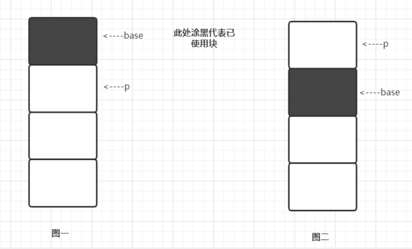
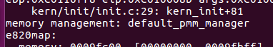
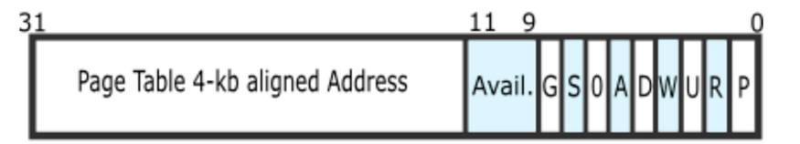
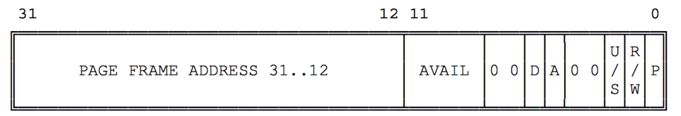
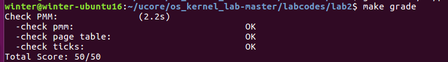

如何发现系统中的物理内存；

如何建立对物理内存的初步管理，即了解连续物理内存管理；

页表相关的操作，即如何建立页表来实现虚拟内存到物理内存之间的映射，对段页式内存管理机制有一个比较全面的了解。

## 练习0

>将`lab1`的代码copy过来

用merge手动合并，两个文件（`kdebug.c`和`trap.c`）手动修改

## 练习1

>first-fit 连续物理内存分配算法

算法实现

（0）初始化链表【`default_init`函数】
（1）空闲分区列表按**地址顺序**排序【`default_init_memmap`函数】
（2）分配过程时,搜索一个合适的分区【`default_alloc_pages`函数】
（3）释放分区时,检查是否可与临近的空闲分区合并【`default_free_pages`函数】

1.`default_init`函数，不用修改

```
static void
default_init(void) {
    list_init(&free_list);//初始化空闲块双向链表
    nr_free = 0;		//空闲块的总数（以页为单位）为0
}
```

2.`default_init_memmap`函数

>根据每个物理页帧的情况来建立空闲页链表，且空闲页块应该是根据地址高低形成一个有序链表。

```
static void
default_init_memmap(struct Page *base, size_t n) {
    assert(n > 0);						//n<=0（不合理），ucore会迅速报错
    struct Page *p = base;				//从空闲链表头开始查找最小的地址
    for (; p != base + n; p ++) {
        p->flags = p->property = 0;		//不被保留，已分配；空闲块的大小为0
        set_page_ref(p, 0);				//引用计数ref清零
    }
    base->property = n;					//base连续内存空闲块的大小为n个
    SetPageProperty(base);
    nr_free += n;						//当前空闲页的个数
    list_add(&free_list, &(base->page_link));//地址从低到高排列；list_add_before：地址从高到地排列 有序就行
}
```

flags表示此**物理页的状态标记**。bit0表示此页**是否被保留**（reserved），如果是**被保留的页**，则bit
0会**设置为1**，且**不能放到空闲页链表中**，即这样的页**不是空闲页，不能动态分配与释放**。在本实验中，**bit1**表示此页**是否是free**的，如果**设置为1**，表示这页是**free的**，可以**被分配**；如果设置为**0**，表示这页已经被分配出去了，不能被再二次分配。

修改：

```
    for (; p != base + n; p ++) {
		assert(PageReserved(p));			//确保可以被保留，可用
        p->flags = p->property = 0;
        set_page_ref(p, 0);
    }
```

3.`default_alloc_pages`函数

```
default_alloc_pages(size_t n) {
    assert(n > 0);				//分配的大小必须大于0
    if (n > nr_free) {			//如果超过最大可用，分配不了，返回
        return NULL;
    }
    struct Page *page = NULL;
    list_entry_t *le = &free_list;
    while ((le = list_next(le)) != &free_list) {//双向链表，没回到起点
        struct Page *p = le2page(le, page_link);//le2page宏可以由链表元素获得对应的Page指针p
        if (p->property >= n) {					//找到的第一个块大于需要的，就是它了，跳出
            page = p;
            break;
        }
    }
	
    if (page != NULL) {							//找到
        list_del(&(page->page_link));			//应该先做操作，然后再从链表上拿下了
        if (page->property > n) {
            struct Page *p = page + n;			//要的块
            p->property = page->property - n;	
            list_add(&free_list, &(p->page_link));
    }
        nr_free -= n;							//分配n个，空闲块的总数-n
        ClearPageProperty(page);
    }
    return page;
}
```

修改：

1）p->property做修改后，要设置下

2）先做操作，再从链表上取下来

```
    if (page != NULL) {							//找到
         if (page->property > n) {
            struct Page *p = page + n;			//要的块
            p->property = page->property - n;	
			SetPageProperty(p);
            list_add(&free_list, &(p->page_link));
		}
		list_del(&(page->page_link));			//应该先做操作，然后再从链表上拿下了
```

4.`default_free_pages`函数

while循环的主要功能是遍历整个空闲链表，看是否有项和要释放的快相邻，有的话进行合并。

```
while (le != &free_list) {
        p = le2page(le, page_link);
        le = list_next(le);
        // TODO: optimize
        if (base + base->property == p) {
            base->property += p->property;
            ClearPageProperty(p);
            list_del(&(p->page_link));
        }
        else if (p + p->property == base) {
            p->property += base->property;
            ClearPageProperty(base);
            base = p;
            list_del(&(p->page_link));
        }
    }
```

图一代表if里的情况，图二代表else if里的情况



由于合并后的块，它的起始地址可能是之前base的，也可能是之前p的，所以不能保证连续，所以，重新循环找一下

```
    le = list_next(&free_list);
    while (le != &free_list) {
        p = le2page(le, page_link);
        if (base + base->property <= p) {//找到合适的地址
            assert(base + base->property != p);//如果相等，同一个位置，不合理情况
            break;
        }
        le = list_next(le);
    }
    list_add_before(le, &(base->page_link));//因为根据块尾的位置找的，所以添加到前面去。
```


有两个函数`list_add_before`和`list_add_after`

*在*元素`@listelm`之前插入新元素`@elm`。 

```
static inline void
list_add_before(list_entry_t *listelm, list_entry_t *elm) {
 __list_add(elm, listelm->prev, listelm);
}
```

在元素`@listelm`后面插入新元素`@elm`，该元素已在列表中。

```
static inline void
list_add_after(list_entry_t *listelm, list_entry_t *elm) {
    __list_add(elm, listelm, listelm->next);
}
```

list_add和list_add_after是一个东西。

```
static inline void
list_add(list_entry_t *listelm, list_entry_t *elm) {
    list_add_after(listelm, elm);
}
```

`make qemu`通过检验



## 练习2

>实现寻找虚拟地址对应的页表项

* `pte_t`、`pde_t`和`uintptr_t`，其实都是unsigned int类型
* `pde_t`（page directory entry）：一级页表的表项
* `pte_t`（page table entry）：二级页表的表项。
* `uintptr_t`：线性地址，由于段式管理只做直接映射，所以它也是逻辑地址。
* `pgdir`实际不是表项，是一级页表本身。给出了页表起始地址。

```
	pde_t *pdep = &pgdir[PDX(la)];		//查找页目录项 指向页目录表的指针已存储在boot_pgdir变量中
	if(!(*pdep & PTE_P)){				//检查页表/目录条目是否不存在
		struct Page *page;
		if(!create || (page = alloc_page()) == NULL){//检查是否需要创建，然后为页表分配页 如果不存在，同时创建失败
			return NULL;
		}
		set_page_ref(page,1);			//表示该页被引用一次
		uintptr_t pa = page2pa(page);	//获取页的线性地址
		memset(KADDR(pa),0,PGSIZE);		//使用memset清除页内容
		*pdep = pa | PTE_U | PTE_W | PTE_P;//设置页目录条目的权限
	}
	return &((pte_t *)KADDR(PDE_ADDR(*pdep)))[PTX(la)];//返回页表项
```

(详细思路参考给出的文件：`setup_paging_map.md`)

（1）请描述页目录项（Page Directory Entry）和页表项（Page Table Entry）中每个组成部分的含义以及对`ucore`而言的潜在用处。

**PDE**



* 前20位表示`4K`对齐的该`PDE`对应的页表起始位置（物理地址，该物理地址的高20位即`PDE`中的高20位，低12位为0）；
* 第9-11位未被CPU使用，可保留给OS使用；
* 接下来的第8位可忽略；
* 第7位用于设置Page大小，0表示`4KB`；
* 第6位恒为0；
* 第5位用于表示该页是否被使用过；
* 第4位设置为1则表示不对该页进行缓存；
* 第3位设置是否使用write through缓存写策略；
* 第2位表示该页的访问需要的特权级；
* 第1位表示是否允许读写；
* 第0位为该`PDE`的存在位；


**PTE**



* 高20位与`PDE`相似的，用于表示该`PTE`向的物理页的物理地址；
* 9-11位保留给OS使用；
* 7-8位恒为0；
* 第6位表示该页是否为dirty，即是否需要在swap out的时候写回外存；
* 第5位表示是否被访问；
* 3-4位恒为0；
* 0-2位分别表示存在位、是否允许读写、访问该页需要的特权级；

**对`ucore`而言的潜在用处**

可以发现无论是`PTE`还是`TDE`，都具有着一些保留的位供操作系统使用，也就是说`ucore`可以利用这些位来完成一些其他的内存管理相关的算法，比如可以在这些位里保存最近一段时间内该页的被访问的次数（仅能表示0-7次），用于辅助近似地实现虚拟内存管理中的换出策略的`LRU`之类的算法；也就是说这些保留位有利于OS进行功能的拓展；

come from：https://www.jianshu.com/p/abbe81dfe016


（2）如果`ucore`执行过程中访问内存，出现了页访问异常，请问硬件要做哪些事情？

- 将发生错误的线性地址保存在`cr2`寄存器中;
- 在中断栈中依次压入`EFLAGS`，CS, `EIP`，以及页访问异常码error code，如果page fault是发生在用户态，则还需要先压入`ss`和esp，并且切换到内核栈；
- 根据中断描述符表查询到对应page fault的`ISR`，跳转到对应的`ISR`处执行，接下来将由软件进行page fault处理；


## 练习3

>释放某虚地址所在的页并取消对应二级页表项的映射

```
	if(*ptep & PTE_P){ //检查此页表项是否存在(请检查ptep是否有效)
		struct Page *page = pte2page(*ptep);//找到对应的页面
		if(page_ref_dec(page) == 0){//页面引用达到0时释放此页面
			free_page(page);
		}
		*ptep = 0;//清除第二页表条目
		tlb_invalidate(pgdir,la);//刷新tlb
	}
```

对应注释即可。

`make grade`命令查看结果



（1）数据结构Page的全局变量（其实是一个数组）的每一项与页表中的页目录项和页表项有无对应关系？如果有，其对应关系是啥？

存在对应关系：由于页表项中存放着对应的物理页的物理地址，因此可以通过这个物理地址来获取到对应到的Page数组的对应项，具体做法为将物理地址除以一个页的大小，然后乘上一个Page结构的大小获得偏移量，使用偏移量加上Page数组的基地址皆可以或得到对应Page项的地址；

（2）如果希望虚拟地址与物理地址相等，则需要如何修改lab2，完成此事？ **鼓励通过编程来具体完成这个问题** 

由于在完全启动了ucore之后，虚拟地址和线性地址相等，都等于物理地址加上0xc0000000，如果需要虚拟地址和物理地址相等，可以考虑更新gdt，更新段映射，使得virtual address = linear address - 0xc0000000，这样的话就可以实现virtual address = physical address；