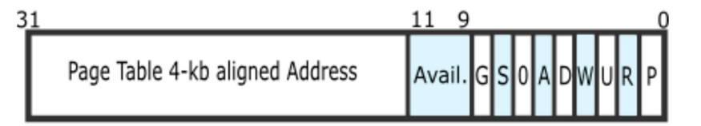

## 知识点

### 按需分配

通过内存地址虚拟化，可以使得软件在没有访问某虚拟内存地址时不分配具体的物理内存，而只有在实际访问某虚拟内存地址时，操作系统再动态地分配物理内存，建立虚拟内存到物理内存的页映射关系。

### 页换入换出

把不经常访问的数据所占的内存空间临时写到硬盘上，这样可以腾出更多的空闲内存空间给经常访问的数据；当CPU访问到不经常访问的数据时，再把这些数据从硬盘读入到内存中。

### mm_struct

```c++
// 使用相同PDT的一组vma的控制结构 the control struct for a set of vma using the same PDT
struct mm_struct {
    list_entry_t mmap_list;        // 双向链表头，链接了所有属于同一页目录表的虚拟内存空间
    struct vma_struct *mmap_cache; // 指向当前正在使用的虚拟内存空间
    pde_t *pgdir;                  // 所维护的页表,通过访问pgdir可以查找某虚拟地址对应的页表项是否存在以及页表项的属性等。
    int map_count;                 // 记录mmap_list 里面链接的 vma_struct的个数。
    void *sm_priv;                 // 指向用来链接记录页访问情况的链表头
};
```


### vma\_struct

描述**应用程序对虚拟内存“需求”**的数据结构

```C++
//虚拟连续内存区（vma），[vm_start, vm_end)，
//地址属于一块vma 意味着 vma.vm_start<= addr <vma.vm_end 
struct vma_struct {
    struct mm_struct *vm_mm; // vma集合使用相同的PDT the set of vma using the same PDT 
    uintptr_t vm_start;      // start addr of vma      
    uintptr_t vm_end;        // 不包括vm_end本身 end addr of vma, not include the vm_end itself
    uint32_t vm_flags;       // flags of vma
    list_entry_t list_link;  // 是 按照起始地址从小到大的顺序 把一系列用vma\_struct表示的虚拟内存空间链接起来 的双向链表 linear list link which sorted by start addr of vma
};
```

**vm_flags**的取值

```c++
#define VM_READ 0x00000001 //只读          001
#define VM_WRITE 0x00000002 //可读写       010       
#define VM_EXEC 0x00000004 //可执行        100
```

**函数**

`insert\_vma\_struct函数`

完成把一个vma变量按照其空间位置[vma-\>vm\_start,vma-\>vm\_end]从小到大的顺序插入到所属的mm变量中的mmap\_list双向链表中。

`find\_vma函数`

根据输入参数addr和mm变量，查找在mm变量中的mmap\_list双向链表中某个vma包含此addr


### <span id="jump">页访问异常错误码</span>

页访问异常错误码有**32位**。

* 位0为１表示对应物理页不存在；
* 位１为１表示写异常（比如写了只读页）
* 位２为１表示访问权限异常（比如用户态程序访问内核空间的数据）

### CR2

页故障线性地址寄存器，保存**最后一次**出现页故障的全32位线性地址。

操作系统中对应的**中断服务例程**可以检查CR2的内容，从而查出线性地址空间中的**哪个页引起本次异常**。

### 页访问异常处理

实现：`do_pgfault函数`

> 根据从CPU的控制寄存器**CR2**中获取的页访问异常的**物理地址**以及根据**errorCode**的错误类型来查找此地址是否**在某个VMA的地址范围内**以及是否**满足正确的读写权限**，如果在此范围内并且权限也正确，这认为这是一次合法访问，但**没有建立虚实对应关系**。所以需要**分配一个空闲的内存页**，并**修改页表**完成**虚地址到物理地址的映射**，**刷新TLB**，然后**调用iret中断**，返回到产生页访问异常的指令处重新执行此指令。如果该虚地址不在某VMA范围内，则认为是一次**非法访问**。

CPU会把产生**异常的线性地址**存储在**CR2**中

给出了出错码**errorCode**（表示**页访问异常类型的值**，简称页访问异常错误码）保存在**中断栈**（保存在**struct trapframe** 中**tf\_err**成员变量）中。

CPU在当前**内核栈**保存当前被打断的程序现场，即依次压入**EFLAGS，CS，EIP，errorCode**

由于页访问异常的中断号是**0xE**，CPU把异常中断号**0xE对应的中断服务例程的地址**（vectors.S中的标号vector14处）加载到**CS和EIP寄存器**中，开始执行中断服务例程。

这时ucore开始**处理异常中断**，首先需要保存硬件没有保存的寄存器。在vectors.S中的标号**vector14处先把中断号压入内核栈**，然后再在trapentry.S中的标号**\_\_alltraps处**把**DS、ES和其他通用寄存器**都压栈。

在trap.c的trap函数开始了中断服务例程的处理流程，大致调用关系为：

> trap--\> trap\_dispatch--\>pgfault\_handler--\>do\_pgfault


### 页面置换机制

需要考虑的问题：

* 哪些页可以被换出？
* 一个虚拟的页如何与硬盘上的扇区建立对应关系？
* 何时进行换入和换出操作？
* 如何设计数据结构以支持页替换算法？
* 如何完成页的换入换出操作？

#### 1. 可以被换出的页

原则：

只有映射到用户空间且被用户程序直接访问的页面才能被交换

被内核直接使用的内核空间的页面不能被换出。

>实验三实现的ucore中，我们只是实现了换入换出机制，还没有设计用户态执行的程序，所以我们在实验三中仅仅通过执行check\_swap函数在内核中分配一些页，模拟对这些页的访问，然后通过do\_pgfault来调用swap\_map\_swappable函数来查询这些页的访问情况并间接调用相关函数，换出“不常用”的页到磁盘上。

#### 2. 虚存中的页与硬盘上的扇区之间的映射关系

PTE：页表项（Page Table Entry）

* 一个PTE用来描述**一般的物理页**时，显然它应该维护各种**权限和映射关系**，以及应该有**PTE\_P标记**；
* 描述一个被**置换出去的物理页**时，它被用来维护该**物理页与 swap 磁盘上扇区的映射关系**，并且该 PTE 不应该由 MMU 将它解释成物理页映射(即没有 PTE\_P 标记)，与此同时对应的**权限**则交由 **mm\_struct** 来维护（当对位于该页的内存地址进行访问的时候，必然导致 page fault，然后ucore能够根据 PTE 描述的 swap 项将相应的物理页重新建立起来，并根据虚存所描述的权限重新设置好 PTE 使得内存访问能够继续正常进行。）




最低位：PTE\_P ，标记为空，表示虚实地址映射关系不存在

高24位数据，用来表示此页在硬盘上的**起始扇区的位置**


一个高24位不为0，而最低位为0的PTE表示了一个放在硬盘上的页的**起始扇区号**

```
swap_entry_t
-------------------------
| offset | reserved | 0 |
-------------------------
24 bits    7 bits   1 bit
```

硬盘的最小访问单位是一个扇区，而一个扇区的大小为512（2^8）字节，所以需要8个连续扇区才能放置一个4KB的页。

在ucore中，用了第二个IDE硬盘来保存被换出的扇区，根据实验三的输出信息

```
“ide 1: 262144(sectors), 'QEMU HARDDISK'.”
```

我们可以知道实验三可以保存262144/8=32768个页，即128MB的内存空间。

#### 3. 执行换入换出的时机

##### 换入

实现：`swap_in函数`

**check\_mm\_struct变量**

* 表示合法的所有虚拟内存空间集合
* mm中的每个vma表示了一段地址连续的合法虚拟空间。

> 调用do\_pgfault函数时，判断产生访问异常的地址属于check\_mm\_struct某个vma表示的合法虚拟地址空间，且保存在硬盘swap文件中（即对应的PTE的高24位不为0，而最低位为0）

##### 换出

实现：`swap_out函数`

**积极换出策略**

周期性地（或在系统不忙的时候）主动把某些认为“不常用”的页换出到硬盘上

**消极换出策略**

当试图得到空闲页时，发现当前没有空闲的物理页可供分配，这时才开始查找“不常用”页面，并把一个或多个这样的页换出到硬盘上。

>实验采用第二种方法

#### 4.页替换算法的数据结构设计

**物理页使用情况**

* 基于数据结构Page的全局变量pages数组
* pages的每一项表示了计算机系统中一个物理页的使用情况。

虚拟页对应的PTE的索引值 = swap page的扇区起始位置\*8。

**页替换算法的类框架swap\_manager**

```c++
struct swap_manager  
{  
    const char *name;  
    int (*init) (void);      /* 交换管理器的全局初始化 */  
    int (*init_mm) (struct mm_struct *mm);      /* 在mm_struct中初始化私有数据 */  
    int (*tick_event) (struct mm_struct *mm);  /*tick中断(定时中断)发生时调用*/  
    int (*map_swappable) (struct mm_struct *mm, uintptr_t addr, struct Page *page, int swap_in);   /*将可交换页面映射到mm_struct时调用*/  
    int (*set_unswappable) (struct mm_struct *mm, uintptr_t addr);  /*当页面标记为共享时，将调用此例程以从交换管理器中删除addr条目*/
    int (*swap_out_victim) (struct mm_struct *mm, struct Page *ptr_page, int in_tick);  /*尝试换出一页，然后返回被换出的页面*/
    int (*check_swap)(void);    /*检查页面替换算法 */  
};  
```

* map\_swappable：记录页访问情况相关属性
* swap\_out\_vistim：挑选需要换出的页
* tick\_event函数指针：结合定时产生的中断，可以实现一种积极的换页策略。

#### 5. check_swap的检查实现

置换算法的页面置换的检查执行逻辑

实现：check_swap（kern/mm/swap.c中）

1. 调用mm\_create建立mm变量，并调用vma\_create创建vma变量，设置合法的访问范围为4KB\~24KB；
2. 调用free\_page等操作，模拟形成一个只有4个空闲物理页；并设置了从4KB\~24KB的连续5个虚拟页的访问操作；
3. 设置记录缺页次数的变量pgfault\_num=0，执行check\_content\_set函数，使得起始地址分别对起始地址为0x1000, 0x2000, 0x3000, 0x4000的虚拟页按时间顺序先后写操作访问，由于之前没有建立页表，所以会产生page fault异常，如果完成练习1，则这些从4KB\~20KB的4虚拟页会与ucore保存的4个物理页帧建立映射关系；
4. 然后对虚页对应的新产生的页表项进行合法性检查；
5. 然后进入测试页替换算法的主体，执行函数check\_content\_access，并进一步调用到\_fifo\_check\_swap函数，如果通过了所有的assert。这进一步表示FIFO页替换算法基本正确实现；
6. 最后恢复ucore环境。

### ucore执行流程

```c++
    pmm_init();                 // 物理内存的管理（lab2）
	
							 //执行中断和异常相关的初始化工作
    pic_init();                 // 初始化中断器 init interrupt controller
    idt_init();                 // 初始化中断向量符表 init interrupt descriptor table

    vmm_init();                 // 检查是否建立了"合法"的虚拟地址 init virtual memory management

    ide_init();                 // 完成对用于页换入换出的硬盘（简称swap硬盘）的初始化工作。init ide devices
    swap_init();                // 页交换算法 init swap
```

练习1：

`vmm_init`： do\_pgfault函数会申请一个空闲物理页，并建立好虚实映射关系，从而使得这样的“合法”虚拟页有实际的物理页帧对应。

练习2：页面置换算法的实现存在对硬盘数据块的读写。

* `ide_init`：完成对用于页换入换出的硬盘（简称swap硬盘）的初始化工作。
* `swap_init`：do\_pgfault来调用swap\_map\_swappable函数来查询这些页的访问情况并间接调用实现页面置换算法的相关函数，把“不常用”的页换出到磁盘上。


## 实践练习

>主要完成ucore内核对虚拟内存的管理工作。

### 练习0

>填写已有实验

然后用`meld`找到对应的文件进行复制。

需要修改的文件：

lab1：`trap.c`、`kdebug.c`、`init.c`（challenge）

lab2：`pmm.c`、`default_pmm.c`

`find . -name "*.[chS]" -exec grep -Hn LAB3 {} \;`

```
winter@winter-ubuntu16:~/ucore/os_kernel_lab-master/labcodes/lab3$ find . -name "*.[chS]" -exec grep -Hn LAB3 {} \;
./kern/mm/swap_fifo.c:52:    /*LAB3 EXERCISE 2: YOUR CODE*/ 
./kern/mm/swap_fifo.c:67:     /*LAB3 EXERCISE 2: YOUR CODE*/ 
./kern/mm/vmm.c:350:    /*LAB3 EXERCISE 1: YOUR CODE
./kern/mm/vmm.c:368:    /*LAB3 EXERCISE 1: YOUR CODE*/
./kern/mm/vmm.c:375:    /*LAB3 EXERCISE 2: YOUR CODE
./kern/trap/trap.c:190:    LAB3 : If some page replacement algorithm(such as CLOCK PRA) need tick to change the priority of pages, 
```


### 练习1

>给未被映射的地址映射上物理页

完成函数：`do_pgfault（mm/vmm.c）函数`

设置访问权限的时候需要参考页面所在 `VMA`的权限，同时需要注意映射物理页时需要操作内存控制结构所指定的页表，而不是内核的页表。

函数原型：

```c++
do_pgfault(struct mm_struct *mm, uint32_t error_code, uintptr_t addr)
```

功能：**中断处理程序**用来**处理页面错误异常**
 * @mm         : 使用相同PDT的一组vma的控制结构
 * @error_code : 由x86硬件设置的trapframe-> tf_err中记录的错误代码
 * @addr       : 导致内存访问异常的addr（CR2寄存器的内容）

尝试找到一个包含addr的vma

```c++
struct vma_struct *vma = find_vma(mm, addr);
```

如果没找到，或者找到的地址比vm的起始地址还小，都不是正确的，报错返回

```c++
    if (vma == NULL || vma->vm_start > addr) {
        cprintf("not valid addr %x, and  can not find it in vma\n", addr);
        goto failed;
    }
```

检查 error_code（不是页面访问异常可以处理的情况，报错）

error_code可以被设置为0、1、2、3

每个值都有对应的含义，根据error_code的值，给出相应的提示，ucore里面没有实现用户模式和特权模式，所以，不用管第三个位。

 *         The P flag   (bit 0) 意味着要么异常是由于页面不存在（0）或者违反访问权限或使用保留位（1）。
 *          The W/R flag (bit 1) 指示导致异常的内存访问是读（0）还是写（1）。
 *         The U/S flag (bit 2) 指示发生异常时处理器是在用户模式（1）还是特权模式（0）下执行。

所以，组合一下

* 00：页面不存在、读异常
* 01：页面不存在、写异常
* 10：违反访问权限或使用保留位、读异常
* 11：违反访问权限或使用保留位、写异常


以下情况是页面访问异常可以继续处理的情况

* 写入一个存在的地址
* 写入一个不存在的地址，但是该地址可写
* 读一个不存在的地址，但是该地址可读

perm记录权限

```c++
uint32_t perm = PTE_U;
if (vma->vm_flags & VM_WRITE) {
       perm |= PTE_W;
}
```

将addr按照PGSIZE对齐

```c++
addr = ROUNDDOWN(addr, PGSIZE);
```

然后到了我们的编程部分

(1) 尝试查找一个pte，如果pte的PT（页面表）不存在，则创建一个PT。

> get_pte : 
>
> 获取一个pte并为la返回该pte的内核虚拟地址
>
> 如果此pte的PT内容不存在，则为PT分配一个页面（注意第3个参数"1"）

```c++
if((ptep = get_pte(mm->pgdir,addr,1)) == NULL)     {  
	cprintf("get_pte in do_pgfault failed\n");
	go failed;
}
```
(2) 如果物理地址不存在，则分配一个页面并用逻辑地址映射到物理地址

如果是新分配的PTD,那么相应的二级页表条目应该是空的(*ptep=0)，这时候我们就分配一页物理空间，建立映射关系，如果分配失败，则报错。

>pgdir_alloc_page : 
>
>调用alloc_page和page_insert函数来分配页面大小的内存和设置
>
>具有线性地址la和PDT pgdir的地址映射pa <---> la
>
>

```c++
if (*ptep == 0) {
     if(pgdir_alloc_page(mm->pgdir,addr,perm) == NULL) { 
			cprintf("pgdir_alloc_page in do_pgfault failed\n");
			goto failed;
	 }
}
```
成功!

```
--------------------- END ---------------------
check_vma_struct() succeeded!
page fault at 0x00000100: K/W [no page found].
check_pgfault() succeeded!
check_vmm() succeeded.
ide 0:      10000(sectors), 'QEMU HARDDISK'.
ide 1:     262144(sectors), 'QEMU HARDDISK'.
```


### 练习2

实现：

`do_pgfault函数(vmm.c)`

`map_swappable、swap_out_victim(swap_fifo.c)`

##### do_pgfault函数

(1）根据mm 和 addr，尝试将右磁盘页面的内容加载到该页面管理的内存中。

```c++
swap_in(mm,addr,&page);
```

（2）根据mm、addr 和page，设置phy addr <--->逻辑地址的映射 

```c++
page_insert(mm->pgdir,page,addr,perm);
```

（3）使页面可交换。

```c++
swap_map_swappable(mm,addr,page,1);
```

（4）设置页替换算法地址。

```c++
page->pra_vaddr = addr;//pra => page replace algorithm
```

为了健壮性，可以设置不符合情况，报错，跳出

```c++
if(失败){
           cprintf("__ in do_pgfault failed\n");
            goto failed;
}
```

注意：`swap_in函数`成功会返回0；

参照swap.c里面的源码可得：

```c++
int
swap_in(struct mm_struct *mm, uintptr_t addr, struct Page **ptr_result)
{
	[...]
     return 0;
}
```


##### map_swappable函数

功能：把最新到达的页面连接在 pra_list_head 队列的后面	

题目中给了两个变量

```c++
list_entry_t *head=(list_entry_t*) mm->sm_priv;//最新到达的页面
list_entry_t *entry=&(page->pra_page_link);
```

```c++
void *sm_priv;                 // 指向用来链接记录页访问情况的链表头
```

所以，直接用list中实现的函数list_add（把第一个参数item加入到第二个参数list后面），即可

```c++
list_add(head,entry);
```

##### swap_out_victim函数

功能：将pra_list_head 队列最早到达页面从链表中取下，然后为*ptr_page的值分配成为该页面的地址。

head表示访问链表，head->prev表示最早到达的页面（队列只有两个可操纵的指针）

因为要为*ptr_page赋值，所以要先把list项转换成page项再赋给它，赋值完才能把list项删掉。

```c++
list_entry_t *le = head->prev;//因为是队列，所以prev指向的是队列的头，最早进来的			
struct Page *p = le2page(le,pra_page_link);								
list_del(le);					//(1)  取消链接pra list_head队列前面的最早到达页面
*ptr_page = p;					//(2)  将*ptr_page的值分配为该页面的地址
```

成功！

```
page fault at 0x00001000: K/R [no page found].
swap_out: i 0, store page in vaddr 0x2000 to disk swap entry 3
swap_in: load disk swap entry 2 with swap_page in vadr 0x1000
count is 0, total is 7
check_swap() succeeded!
++ setup timer interrupts
100 ticks
100 ticks
```

#### 回答问题

 - 请描述页目录项（Page Directory Entry）和页表项（Page Table Entry）中组成部分对ucore实现页替换算法的潜在用处。

>分页机制的实现，确保了虚拟地址和物理地址之间的对应关系.
>
>一方面，通过查找虚拟地址是否存在于一二级页表中，可以容易发现该地址是否是合法的;
>
>另一方面，通过修改映射关系即可实现页替换操作。

 - 如果ucore的缺页服务例程在执行过程中访问内存，出现了页访问异常，请问硬件要做哪些事情？

   ​	见“知识点-也访问异常处理”，[点击跳转](#jump)

### 附录

正确输出的参考：   

```
$ make qemu
(THU.CST) os is loading ...
Special kernel symbols:
entry 0xc010002c (phys)
etext 0xc010962b (phys)
edata 0xc0122ac8 (phys)
end 0xc0123c10 (phys)
Kernel executable memory footprint: 143KB
memory management: default_pmm_manager
e820map:
memory: 0009f400, [00000000, 0009f3ff], type = 1.
memory: 00000c00, [0009f400, 0009ffff], type = 2.
memory: 00010000, [000f0000, 000fffff], type = 2.
memory: 07efd000, [00100000, 07ffcfff], type = 1.
memory: 00003000, [07ffd000, 07ffffff], type = 2.
memory: 00040000, [fffc0000, ffffffff], type = 2.
check_alloc_page() succeeded!
check_pgdir() succeeded!
check_boot_pgdir() succeeded!
-------------------- BEGIN --------------------
PDE(0e0) c0000000-f8000000 38000000 urw
|-- PTE(38000) c0000000-f8000000 38000000 -rw
PDE(001) fac00000-fb000000 00400000 -rw
|-- PTE(000e0) faf00000-fafe0000 000e0000 urw
|-- PTE(00001) fafeb000-fafec000 00001000 -rw
--------------------- END ---------------------
check_vma_struct() succeeded!
page fault at 0x00000100: K/W [no page found].
check_pgfault() succeeded!
check_vmm() succeeded.
ide 0: 10000(sectors), 'QEMU HARDDISK'.
ide 1: 262144(sectors), 'QEMU HARDDISK'.
SWAP: manager = fifo swap manager
BEGIN check_swap: count 1, total 31992
mm->sm_priv c0123c04 in fifo_init_mm
setup Page Table for vaddr 0X1000, so alloc a page
setup Page Table vaddr 0~4MB OVER!
set up init env for check_swap begin!
page fault at 0x00001000: K/W [no page found].
page fault at 0x00002000: K/W [no page found].
page fault at 0x00003000: K/W [no page found].
page fault at 0x00004000: K/W [no page found].
set up init env for check_swap over!
write Virt Page c in fifo_check_swap
write Virt Page a in fifo_check_swap
write Virt Page d in fifo_check_swap
write Virt Page b in fifo_check_swap
write Virt Page e in fifo_check_swap
page fault at 0x00005000: K/W [no page found].
swap_out: i 0, store page in vaddr 0x1000 to disk swap entry 2
write Virt Page b in fifo_check_swap
write Virt Page a in fifo_check_swap
page fault at 0x00001000: K/W [no page found].
swap_out: i 0, store page in vaddr 0x2000 to disk swap entry 3
swap_in: load disk swap entry 2 with swap_page in vadr 0x1000
write Virt Page b in fifo_check_swap
page fault at 0x00002000: K/W [no page found].
swap_out: i 0, store page in vaddr 0x3000 to disk swap entry 4
swap_in: load disk swap entry 3 with swap_page in vadr 0x2000
write Virt Page c in fifo_check_swap
page fault at 0x00003000: K/W [no page found].
swap_out: i 0, store page in vaddr 0x4000 to disk swap entry 5
swap_in: load disk swap entry 4 with swap_page in vadr 0x3000
write Virt Page d in fifo_check_swap
page fault at 0x00004000: K/W [no page found].
swap_out: i 0, store page in vaddr 0x5000 to disk swap entry 6
swap_in: load disk swap entry 5 with swap_page in vadr 0x4000
check_swap() succeeded!
++ setup timer interrupts
100 ticks
End of Test.
kernel panic at kern/trap/trap.c:20:
EOT: kernel seems ok.
Welcome to the kernel debug monitor!!
Type 'help' for a list of commands.   
```