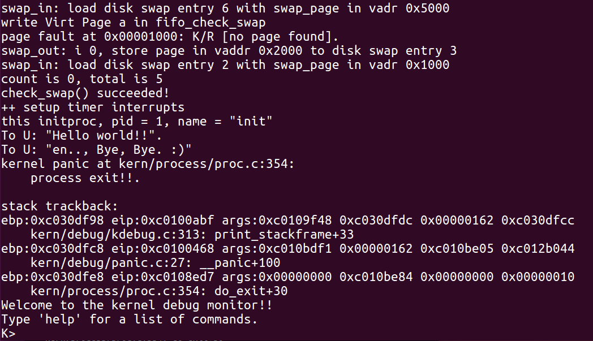

## 知识

### 内核线程与用户进程的区别：

（1）运行状态不同

 - 内核线程只运行在内核态
 - 用户进程会在在用户态和内核态交替运行

（2）所用空间不同

 - 所有内核线程共用ucore内核内存空间，不需为每个内核线程维护单独的内存空间
 - 而用户进程需要维护各自的用户内存空间

### 进程控制块 PCB

```c++
//kern/process/proc.h
struct proc_struct {
	enum proc_state state; // Process state
	int pid; // Process ID
	int runs; // the running times of Proces
	uintptr_t kstack; // Process kernel stack
	volatile bool need_resched; // need to be rescheduled to release CPU?
	struct proc_struct *parent; // the parent process
	struct mm_struct *mm; // Process's memory management field
	struct context context; // Switch here to run process
	struct trapframe *tf; // Trap frame for current interrupt
	uintptr_t cr3; // the base addr of Page Directroy Table(PDT)
	uint32_t flags; // Process flag
	char name[PROC_NAME_LEN + 1]; // Process name
	list_entry_t list_link; // Process link list
	list_entry_t hash_link; // Process hash list
};
```


* mm：内存管理的信息，包括内存映射列表、页表指针等。mm数据结构是用来实现**用户空间**的**虚存管理**的，但是内核线程没有mm 结构，是NULL。
* proc\_struct数据结构中的cr3成员变量，代替pgdir项来记录页表起始地址，指向了uCore启动时建立好的内核虚拟空间的页目录表首地址。

* 在所有进程中，只有一个进程没有父进程，就是内核创建的第一个内核线程idleproc。【内核根据这个父子关系建立一个树形结构】
*  tf：中断帧的指针，记录了进程在被中断前的状态。为了保证**嵌套中断**发生时tf 总是能够指向当前的trapframe，uCore 在内核栈上维护了 tf 的链
* uCore在创建进程时分配了 2 个连续的物理页作为内核栈的空间。
* kstack记录了分配给该进程/线程的内核栈的位置。
* 当内核准备从一个进程切换到另一个的时候，需要根据kstack 的值正确的设置好 **tss** ，以便在进程切换以后再发生中断时能够使用正确的栈。
* 内核栈位于内核地址空间，并且是不共享的（每个线程都拥有自己的内核栈），因此不受到 mm 的管理。

#### 管理进程控制块

（设置一些全局变量,`kern/process/proc.c`）

● static struct proc \*current：当前占用CPU且处于“运行”状态进程控制块指针。通常这个变量是只读的，只有在进程切换的时候才进行修改，并且整个切换和修改过程需要保证操作的原子性，目前至少需要屏蔽中断。可以参考 switch\_to 的实现。

● static struct proc \*initproc：本实验中，指向一个内核线程。本实验以后，此指针将指向第一个用户态进程。

● static list\_entry\_t hash\_list[HASH\_LIST\_SIZE]：所有进程控制块的哈希表，proc\_struct中的成员变量hash\_link将基于pid链接入这个哈希表中。

● list\_entry\_t proc\_list：所有进程控制块的双向线性列表，proc\_struct中的成员变量list\_link将链接入这个链表中。

### 创建第0个内核线程idleproc

>完成内核中各个子系统的初始化，然后就通过执行cpu\_idle函数开始过退休生活了。

uCore通过给**当前执行的上下文**分配一个进程控制块以及对它进行相应初始化，将其打造成第0个内核线程 -- idleproc。

#### <span id="jump">最基本的初始化</span>

首先调用alloc\_proc函数来通过kmalloc函数获得proc\_struct结构的一块内存块，作为第0个进程控制块。并把proc进行初步初始化（即把proc\_struct中的各个成员变量清零）。但有些成员变量设置了特殊的值，比如：

```c++
 proc->state = PROC_UNINIT;  设置进程为“初始”态
 proc->pid = -1;             设置进程pid的未初始化值
 proc->cr3 = boot_cr3;       使用内核页目录表的基址
 ...
```

boot_cr3：uCore内核页表的起始地址，表明由于该内核线程在内核中运行

所有内核线程的内核虚地址空间（也包括物理地址空间）是相同的。

#### 进一步初始化

```c++
idleproc->pid = 0;
idleproc->state = PROC_RUNNABLE;
idleproc->kstack = (uintptr_t)bootstack;
idleproc->need_resched = 1;
set_proc_name(idleproc, "idle");
```

第三条语句设置了idleproc所使用的内核栈的起始地址。需要注意以后的其他线程的内核栈都需要通过分配获得，因为uCore启动时设置的内核栈直接分配给idleproc使用了。

第四条语句中，只要此标志为1，马上就调用schedule函数要求调度器切换其他进程执行。

### 创建第1个内核线程 initproc 

idleproc => kernel_thread => init_main => initproc

> init_main
>
> 本实验：输出一些字符串，然后就返回了
>
> 后续实验：创建特定的其他内核线程或用户进程


```c++
kernel_thread(int (*fn)(void *), void *arg, uint32_t clone_flags)
{
	struct trapframe tf;
	memset(&tf, 0, sizeof(struct trapframe));
	tf.tf_cs = KERNEL_CS;
	tf.tf_ds = tf_struct.tf_es = tf_struct.tf_ss = KERNEL_DS;
	tf.tf_regs.reg_ebx = (uint32_t)fn;
	tf.tf_regs.reg_edx = (uint32_t)arg;
	tf.tf_eip = (uint32_t)kernel_thread_entry;
	return do_fork(clone_flags | CLONE_VM, 0, &tf);
}
```

initproc内核线程从tf.tf\_eip指向的kernel\_thread\_entry开始执行

```c++
kernel_thread_entry: # void kernel_thread(void)
pushl %edx # push arg
call *%ebx # call fn
pushl %eax # save the return value of fn(arg)
call do_exit # call do_exit to terminate current thread
```

为内核线程的主体**fn函数**做了一个准备开始和结束运行的“壳”

#### do_fork()

>创建线程的主要函数

功能：

1. 分配并初始化进程控制块（alloc\_proc函数）；
2. 分配并初始化内核栈（setup\_stack函数）；
3. 根据clone\_flag标志复制或共享进程内存管理结构（copy\_mm函数）；（只能创建内核线程，所有设为NULL，不用复制）  【前3步执行没有成功，则需要做对应的出错处理，把相关已经占有的内存释放掉。】
4. 设置进程在内核（将来也包括用户态）正常运行和调度所需的**中断帧和执行上下文**（copy\_thread函数）；
5. 把设置好的进程控制块放入hash\_list和proc\_list两个全局进程链表中；
6. 自此，进程已经准备好执行了，把进程状态设置为“就绪”态；
7. 设置返回码为子进程的id号。

```c++
//copy_thread()
static void
copy_thread(struct proc_struct *proc, uintptr_t esp, struct trapframe *tf) {
	//在内核堆栈的顶部设置中断帧大小的一块栈空间
	proc->tf = (struct trapframe *)(proc->kstack + KSTACKSIZE) - 1;
	*(proc->tf) = *tf; //拷贝在kernel_thread函数建立的临时中断帧的初始值
	proc->tf->tf_regs.reg_eax = 0;
	//设置子进程/线程执行完do_fork后的返回值
	proc->tf->tf_esp = esp; //设置中断帧中的栈指针esp
	proc->tf->tf_eflags |= FL_IF; //使能中断
	proc->context.eip = (uintptr_t)forkret;
	proc->context.esp = (uintptr_t)(proc->tf);
}
```

```c++
//initproc函数的中断帧
//所在地址位置
initproc->tf= (proc->kstack+KSTACKSIZE) – sizeof (struct trapframe);
//具体内容
initproc->tf.tf_cs = KERNEL_CS;
initproc->tf.tf_ds = initproc->tf.tf_es = initproc->tf.tf_ss = KERNEL_DS;
initproc->tf.tf_regs.reg_ebx = (uint32_t)init_main;
initproc->tf.tf_regs.reg_edx = (uint32_t) ADDRESS of "Helloworld!!";
initproc->tf.tf_eip = (uint32_t)kernel_thread_entry;
initproc->tf.tf_regs.reg_eax = 0;
initproc->tf.tf_esp = esp;
initproc->tf.tf_eflags |= FL_IF;
```

### 调度并执行内核线程 initproc 

proc\_init函数：创建好了两个内核线程：idleproc和initproc

uCore在实验四中只实现了一个最简单的FIFO调度器，其核心就是schedule函数。

schedule函数

1．设置**当前**内核线程current-\>**need\_resched**为**0**；
2．在**proc\_list**队列中查找下一个处于**“就绪”态**的线程或进程next；
3．找到这样的进程后，就调用**proc\_run**函数，**保存**当前进程current的执行现场（进程**上下文**），**恢复**新进程的**执行现场**，**完成进程切换**。

lab4里面只有idleproc和initproc

idleproc让出cpu => schedule => 查找proc_list => 找到initproc => 执行proc_run和switch_to完成两个执行现场的切换

#### switch_to函数

```assembly
.globl switch_to
switch_to: # switch_to(from, to)
# save from's registers
movl 4(%esp), %eax # eax points to from
popl 0(%eax) # esp--> return address, so save return addr in FROM’s
context
movl %esp, 4(%eax)
……
movl %ebp, 28(%eax)
# restore to's registers
movl 4(%esp), %eax # not 8(%esp): popped return address already
# eax now points to to
movl 28(%eax), %ebp
……
movl 4(%eax), %esp
pushl 0(%eax) # push TO’s context’s eip, so return addr = TO’s eip
ret # after ret, eip= TO’s eip
```

执行最后一条指令“ret”时，会把栈顶的内容赋值给EIP寄存器，这样就切换到下一个进程执行了


在对initproc进行初始化时，设置了initproc-\>context.eip = (uintptr\_t)forkret，这样，当执行switch\_to函数并返回后，initproc将执行其实际上的执行入口地址forkret。

#### forkret

```assembly
.globl __trapret
 __trapret:
 # restore registers from stack
 popal
 # restore %ds and %es
 popl %es
 popl %ds
 # get rid of the trap number and error code
 addl $0x8, %esp
 iret
 .globl forkrets
 forkrets:
 # set stack to this new process's trapframe
 movl 4(%esp), %esp //把esp指向当前进程的中断帧
 jmp __trapret
```

forkrets函数首先把esp指向当前进程的中断帧.

从\_trapret开始执行到iret前，esp指向了current-\>tf.tf\_eip，而如果此时执行的是initproc，则current-\>tf.tf\_eip=**kernel\_thread\_entry**，initproc-\>tf.tf\_cs = KERNEL\_CS，所以当执行完iret后，就开始在内核中执行kernel\_thread\_entry函数了，而initproc-\>tf.tf\_regs.**reg\_ebx** = **init\_main**，所以在kernl\_thread\_entry中执行“call %ebx”后，就开始执行initproc的主体了。Initprocde的主体函数很简单就是输出一段字符串，然后就返回到kernel\_tread\_entry函数，并进一步调用do\_exit执行退出操作了。本来do\_exit应该完成一些资源回收工作等.

### 总体过程概述

进程控制块【管理线程的数据结构】 => 进程控制块链表【随时进行插入，删除和查找操作等进程管理事务】=> 调度器对CPU分时共享

具体实现：

proc\_init函数作用：完成了idleproc内核线程和initproc内核线程的创建或复制工作。

idleproc内核线程：不停地查询，看是否有其他内核线程可以执行了，如果有，马上让调度器选择那个内核线程执行（请参考cpu\_idle函数的实现）。

```c++
void
cpu_idle(void) {
    while (1) {
        if (current->need_resched) {
            schedule();
        }
    }
}
```

idleproc内核线程是在ucore操作系统**没有其他内核线程可执行**的情况下才会被调用。

initproc内核线程:显示“Hello World”【调用kernel\_thread函数来创建initproc内核线程】

```c++
    int pid = kernel_thread(init_main, "Hello world!!", 0);
    if (pid <= 0) {
        panic("create init_main failed.\n");
    }

    initproc = find_proc(pid);
    set_proc_name(initproc, "init");
```

进程调度的过程：在进程控制块链表中查找到一个“合适”的内核线程，（内核线程处于“PROC\_RUNNABLE”状态）。

## 练习

> 目的：了解内核线程 创建/执行的管理、切换和基本调度过程

### 练习0

>填写已有实验

然后用`meld`找到对应的文件进行复制。

需要修改的文件：

lab1：`trap.c`、`kdebug.c`、`init.c`（challenge）

lab2：`pmm.c`、`default_pmm.c`

lab3：`vmm.c`、`swap_fifo.c`

`find . -name "*.[chS]" -exec grep -Hn LAB4 {} \;`

```
winter@winter-ubuntu16:~/ucore/os_kernel_lab-master/labcodes/lab4$ find . -name "*.[chS]" -exec grep -Hn LAB4 {} \;
./kern/process/proc.c:89:    //LAB4:EXERCISE1 YOUR CODE
./kern/process/proc.c:274:    //LAB4:EXERCISE2 YOUR CODE
```

### 练习1

`alloc_proc函数`（位于`kern/process/proc.c`中）

> 目标：分配并初始化一个进程控制块
>
> 具体：对struct proc_struct结构做最基本的初始化，用于存储建立的内核线程的管理信息。

题目注释里面，给出了所有初始化的项。

答案

```c++
		proc->state = PROC_UNINIT;
		proc->pid = -1;
		proc->runs = 0;
		proc->kstack = 0;
		//typedef uint32_t uintptr_t;
		proc->need_resched = 0;
		proc->parent = NULL;
		proc->mm = NULL;
		//proc->context = NULL;
		memset(&(proc->context),0,sizeof(struct context));
		proc->tf = NULL;
		//proc->cr3 = NULL;
		proc->cr3 = boot_cr3;
		proc->flags = 0;
		//proc->name = NULL;
		memset(proc->name,0,PROC_NAME_LEN);
```

方法：数值初始化为0，指针初始化为NULL

特殊：

state是PROC_UNINIT，pid是-1，详见（[点击跳转](#jump)）

数组和结构体，使用memset

#### memset

>C/C++语言初始化函数。
>
>将某一块内存中的内容全部设置为指定的值

```c++
void *memset(void *s, int ch, size_t n);
//函数解释：将s中当前位置后面的n个字节 （typedef unsigned int size_t ）用 ch 替换并返回 s 。
```

#### 问题回答

`struct context context`变量含义：上下文，本质上就是各种寄存器的值

```c++
//为内核上下文切换保存的寄存器。
// 不需要保存所有的％fs等段寄存器，因为它们在内核上下文中是恒定的。
// 保存所有常规寄存器，因此我们不需要关心这是调用者保存的，但不是返回寄存器％eax。
//（不保存％eax只是简化了切换代码。）
//上下文的布局必须与switch.S中的代码匹配。
struct context {
    uint32_t eip;
    uint32_t esp;
    uint32_t ebx;
    uint32_t ecx;
    uint32_t edx;
    uint32_t esi;
    uint32_t edi;
    uint32_t ebp;
};
```


`struct trapframe *tf`：中断帧，保存当前进程所有的状态，方便日后返回的时候恢复。

```c++
struct trapframe {
    struct pushregs tf_regs;
    uint16_t tf_gs;
    uint16_t tf_padding0;
    uint16_t tf_fs;
    uint16_t tf_padding1;
    uint16_t tf_es;
    uint16_t tf_padding2;
    uint16_t tf_ds;
    uint16_t tf_padding3;
    uint32_t tf_trapno;
    /* below here defined by x86 hardware */
    uint32_t tf_err;
    uintptr_t tf_eip;
    uint16_t tf_cs;
    uint16_t tf_padding4;
    uint32_t tf_eflags;
    /* below here only when crossing rings, such as from user to kernel */
    uintptr_t tf_esp;
    uint16_t tf_ss;
    uint16_t tf_padding5;
} __attribute__((packed));
```

### 练习2

`do_fork函数`（位于`kern/process/proc.c`中）

>目标：为新创建的内核线程分配资源

功能：

* 调用alloc\_proc，首先获得一块用户信息块。
* 为进程分配一个内核栈。
* 复制原进程的内存管理信息到新进程（但内核线程不必做此事）
* 复制原进程上下文到新进程
* 将新进程添加到进程列表
* 唤醒新进程
* 返回新进程号

可能用到的宏、函数

	alloc_proc：创建一个proc结构体和init字段（lab4：exercise1）
	setup_kstack：将大小为KSTACKPAGE的页面分配为进程内核堆栈
	copy_mm：进程“ proc”重复或根据clone_flags共享进程“current”的mm，if clone_flags & CLONE_VM, then "share"; else "duplicate"
	copy_thread：在进程的内核堆栈顶部设置trapframe，然后设置内核入口点和进程堆栈
	hash_proc：将proc添加到proc hash_list中
	get_pid：为进程分配唯一的pid
	wakeup_proc：设置proc-> state = PROC_RUNNABLE
变量

```
proc_list：过程集的列表
nr_process：设置的进程数
```


```c++
	// 1.调用alloc_proc分配proc_struct
	if((proc = alloc_proc()) == NULL){
		goto fork_out;
	}
	
	proc->parent = current;
	
	// 2.调用setup_kstack为子进程分配内核堆栈
	if(setup_kstack(proc)!=0){
		goto bad_fork_cleanup_proc;
	}
	
	// 3.调用copy_mm进行复制或根据clone_flag共享mm
	if(copy_mm(clone_flags,proc)!=0){
		goto bad_fork_cleanup_kstack;
	}
	
	// 4.调用copy_thread在proc_struct中设置tf和上下文
	copy_thread(proc,stack,tf);
	
	// 5.将proc_struct插入hash_list && proc_list
	bool intr_flag;
	local_intr_save(intr_flag);
	{
		proc->pid = get_pid();
		hash_proc(proc);
		list_add(&proc_list,&(proc->list_link));
		nr_process ++;
	}
	local_intr_restore(intr_flag);
	
	// 6.调用wakeup_proc使新的子进程RUNNABLE
	wakeup_proc(proc);
	
	// 7.使用子proc的pid设置ret vaule
	ret = proc->pid;
```

中间出了一点点问题，，，是lab3的锅，，，

有一段原来是这么写的。。。

```c++
        if(swap_init_ok) {
            struct Page *page=NULL;
			if(swap_in(mm,addr,&page)!=0){		//(1）根据mm AND addr，尝试将右磁盘页面的内容加载到该页面管理的内存中。
				cprintf("swap_in in do_pgfault failed\n");
				goto failed;
			}							
			if(page_insert(mm->pgdir,page,addr,perm)){//(2)根据mm，addr AND页面，设置phy addr <--->逻辑地址的映射 
				cprintf("page_insert in do_pgfault failed\n");
				goto failed;
			}		
			if(swap_map_swappable(mm,addr,page,1)){//(3) 使页面可交换。
				cprintf("swap_map_swappable in do_pgfault failed\n");
				goto failed;
			}	
			page->pra_vaddr = addr;//page replace algorithm
        }
```

问题处在了`swap_map_swappable`这里,原型返回的值是非0值，所以执行if语句的话，就直接`goto failed;`了，所以把if不要了就好。。。取非也行。

```c++
int
swap_map_swappable(struct mm_struct *mm, uintptr_t addr, struct Page *page, int swap_in)
{
     return sm->map_swappable(mm, addr, page, swap_in);
}
```

修改为：

```c++
        if(swap_init_ok) {
            struct Page *page=NULL;
			if(swap_in(mm,addr,&page)!=0){		//(1）根据mm AND addr，尝试将右磁盘页面的内容加载到该页面管理的内存中。
				cprintf("swap_in in do_pgfault failed\n");
				goto failed;
			}							
			if(page_insert(mm->pgdir,page,addr,perm)){//(2)根据mm，addr AND页面，设置phy addr <--->逻辑地址的映射 
				cprintf("page_insert in do_pgfault failed\n");
				goto failed;
			}		
			swap_map_swappable(mm, addr, page, 1);
			page->pra_vaddr = addr;//page replace algorithm
        }
```

### 练习3

> 阅读代码，理解 proc\_run 函数和它调用的函数如何完成进程切换的。（无编码工作） 

请在实验报告中简要说明你对proc\_run函数的分析。并回答如下问题：

 - 在本实验的执行过程中，创建且运行了几个内核线程？

两个，idleproc和initproc

 - 语句`local_intr_save(intr_flag);....local_intr_restore(intr_flag);`在这里有何作用?请说明理由

防止进程切换的时候被打断，实现原子性。因为`...`里面实现的功能是实现进程切换，不应该被打断，，，

#### proc_run

功能：使进程proc运行在cpu上

注意：在调用switch_to函数之前，应该加载新的proc的页表的机制

```c++
void proc_run(struct proc_struct *proc) {
    if (proc != current) {//先判断是否已经运行了
        bool intr_flag;
        struct proc_struct *prev = current, *next = proc;
        local_intr_save(intr_flag);//如果遇到中断了，并不可被别的中断打断
        {
            current = proc;//将proc设置为当前进程
            load_esp0(next->kstack + KSTACKSIZE);
            lcr3(next->cr3);//设置新的页表起始地址
            switch_to(&(prev->context), &(next->context));//将正在运行的和proc switch_to
        }
        local_intr_restore(intr_flag);//完成了，取消不被别的中断打断
    }
}
```


关于`local_intr_save`函数

```
#define local_intr_save(x)      do { x = __intr_save(); } while (0)
```

```
static inline bool
__intr_save(void) {
    if (read_eflags() & FL_IF) {
        intr_disable();
        return 1;
    }
    return 0;
}
```

是中断标志

```
#define FL_IF           0x00000200  // Interrupt Flag
```

`read_eflags() & FL_IF`，就是看eflags中是否设置了中断标志，如果设置了，就`intr_disable();`不受其他中断打断，否则，就没啥事，，，

`intr_disable()`具体如下

```
/* intr_disable - disable irq interrupt */
void
intr_disable(void) {
    cli();
}
```

```
static inline void
cli(void) {
    asm volatile ("cli" ::: "memory");
}
```

cli汇编指令全称为Clear Interupt，该指令的作用是禁止中断发生，在CLI起效之后，所有外部中断都被屏蔽，这样可以保证当前运行的代码不被打断，起到保护代码运行的作用。


local_intr_restore实质就是执行了sti，cli对应相反的指令。

STI汇编指令全称为Set Interupt，该指令的作用是允许中断发生，在STI起效之后，所有外部中断都被恢复，这样可以打破被保护代码的运行，允许硬件中断转而处理中断的作用。



### 参考输出

```
make qemu
 (THU.CST) os is loading ...
 
 Special kernel symbols:
 entry 0xc010002c (phys)
 etext 0xc010d0f7 (phys)
 edata 0xc012dad0 (phys)
 end 0xc0130e78 (phys)
 Kernel executable memory footprint: 196KB
 memory management: default_pmm_manager
 e820map:
 memory: 0009f400, [00000000, 0009f3ff], type = 1.
 memory: 00000c00, [0009f400, 0009ffff], type = 2.
 memory: 00010000, [000f0000, 000fffff], type = 2.
 memory: 07efd000, [00100000, 07ffcfff], type = 1.
 memory: 00003000, [07ffd000, 07ffffff], type = 2.
 memory: 00040000, [fffc0000, ffffffff], type = 2.
 check_alloc_page() succeeded!
 check_pgdir() succeeded!
 check_boot_pgdir() succeeded!
 -------------------- BEGIN --------------------
 PDE(0e0) c0000000-f8000000 38000000 urw
 |-- PTE(38000) c0000000-f8000000 38000000 -rw
 PDE(001) fac00000-fb000000 00400000 -rw
 |-- PTE(000e0) faf00000-fafe0000 000e0000 urw
 |-- PTE(00001) fafeb000-fafec000 00001000 -rw
 --------------------- END ---------------------
 check_slab() succeeded!
 kmalloc_init() succeeded!
 check_vma_struct() succeeded!
 page fault at 0x00000100: K/W [no page found].
 check_pgfault() succeeded!
 check_vmm() succeeded.
 ide 0: 10000(sectors), 'QEMU HARDDISK'.
 ide 1: 262144(sectors), 'QEMU HARDDISK'.
 SWAP: manager = fifo swap manager
 BEGIN check_swap: count 1, total 31944
 mm->sm_priv c0130e64 in fifo_init_mm
 setup Page Table for vaddr 0X1000, so alloc a page
 setup Page Table vaddr 0~4MB OVER!
 set up init env for check_swap begin!
 page fault at 0x00001000: K/W [no page found].
 page fault at 0x00002000: K/W [no page found].
 page fault at 0x00003000: K/W [no page found].
 page fault at 0x00004000: K/W [no page found].
 set up init env for check_swap over!
 write Virt Page c in fifo_check_swap
 write Virt Page a in fifo_check_swap
 write Virt Page d in fifo_check_swap
 write Virt Page b in fifo_check_swap
 write Virt Page e in fifo_check_swap
 page fault at 0x00005000: K/W [no page found].
 swap_out: i 0, store page in vaddr 0x1000 to disk swap entry 2
 write Virt Page b in fifo_check_swap
 write Virt Page a in fifo_check_swap
 page fault at 0x00001000: K/W [no page found].
 swap_out: i 0, store page in vaddr 0x2000 to disk swap entry 3
 swap_in: load disk swap entry 2 with swap_page in vadr 0x1000
 write Virt Page b in fifo_check_swap
 page fault at 0x00002000: K/W [no page found].
 swap_out: i 0, store page in vaddr 0x3000 to disk swap entry 4
 swap_in: load disk swap entry 3 with swap_page in vadr 0x2000
 write Virt Page c in fifo_check_swap
 page fault at 0x00003000: K/W [no page found].
 swap_out: i 0, store page in vaddr 0x4000 to disk swap entry 5
 swap_in: load disk swap entry 4 with swap_page in vadr 0x3000
 write Virt Page d in fifo_check_swap
 page fault at 0x00004000: K/W [no page found].
 swap_out: i 0, store page in vaddr 0x5000 to disk swap entry 6
 swap_in: load disk swap entry 5 with swap_page in vadr 0x4000
 check_swap() succeeded!
 ++ setup timer interrupts
 this initproc, pid = 1, name = "init"
 To U: "Hello world!!".
 To U: "en.., Bye, Bye. :)"
 kernel panic at kern/process/proc.c:316:
 process exit!!.
 
 Welcome to the kernel debug monitor!!
 Type 'help' for a list of commands.
 K>
```

