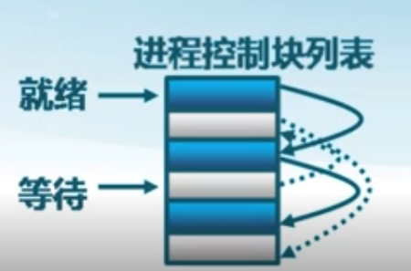
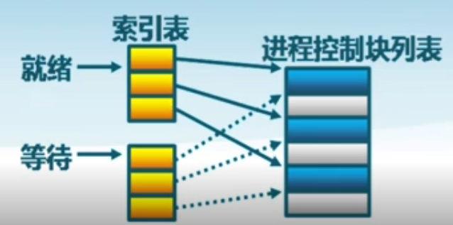
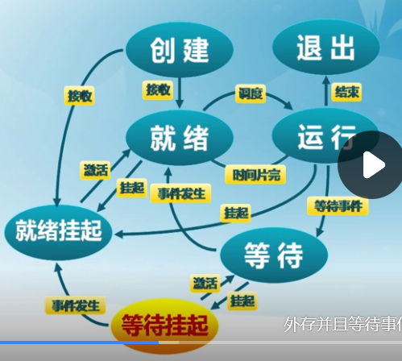
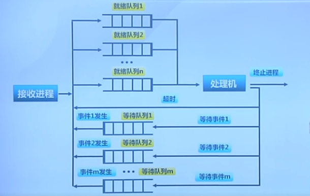
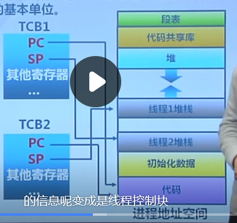
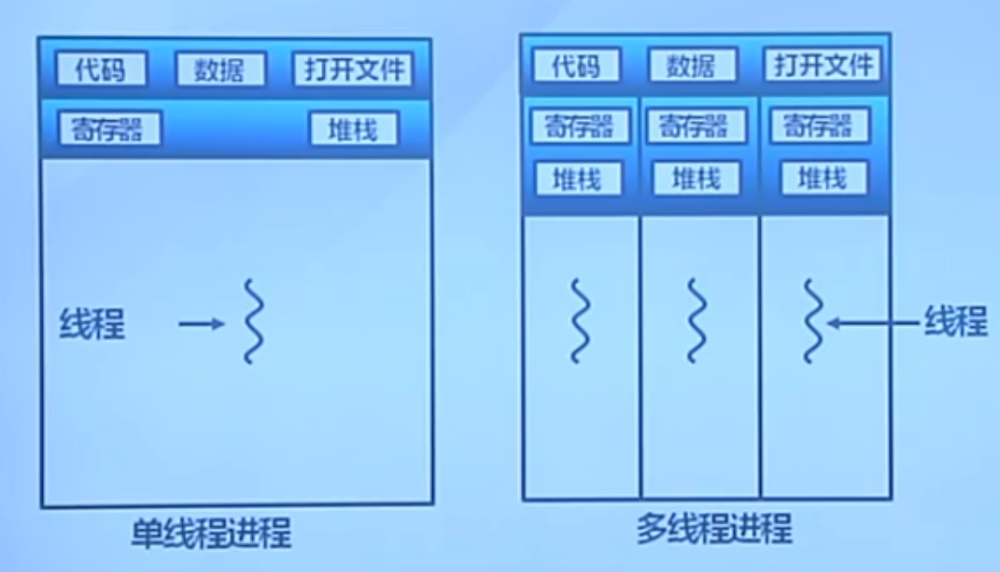
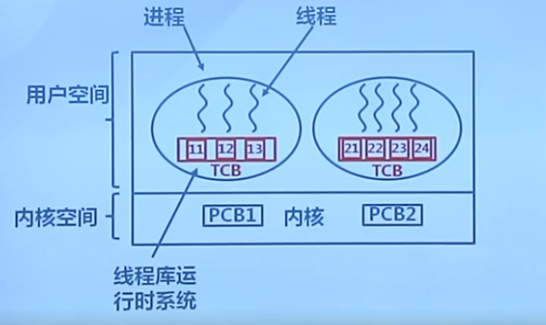
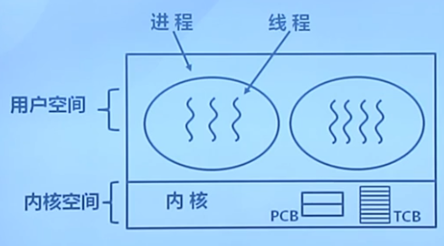
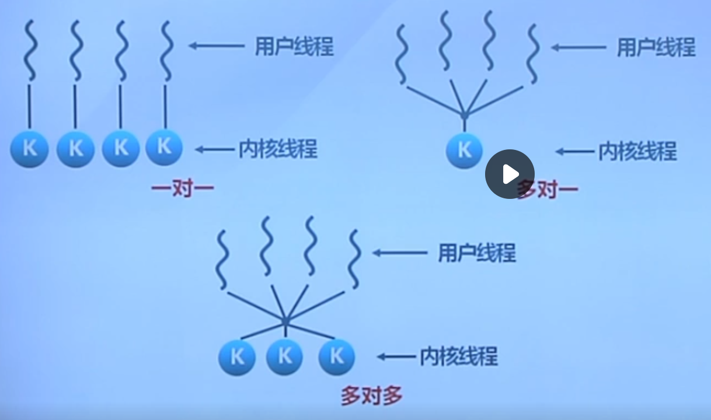

## 1.进程的概念

### 定义

进程是指一个具有一定**独立功能**的程序在一个**数据集合**上的一次**动态执行**过程

### 进程与程序的联系

（1）进程是操作系统处于执行状态程序的抽象

* 程序=文件(静态的可执行文件)
* 进程=执行中的程序=程序+执行状态

（2）同一个程序的多次执行过程对应为不同进程
如命令"Is" 的多次执行对应多进个进程
（3）进程执行需要的资源

* 内存:保存代码和数据
* CPU :执行指令

（4）进程是动态的 ,程序是静态的
（5）进程是暂时的（状态变化的过程） ,程序的永久的（长久保存）
（6）进程的组成包括程序、数据和进程控制块

## 2.进程控制块

全称Process Control Block（PCB）

作用：

操作系统用PCB来描述**进程的基本情况**以及**运行变化的过程**

特点： 

PCB是进程存在的唯一标志

每个进程都在操作系统中有一个对应的PCB

内容：

进程标识信息
处理机现场保存
进程控制信息

### 进程控制信息

（1）调度和状态信息

进程和处理机使用情况调度

（2）进程间通信信息

进程间通信相关的各种标识

（3）存储管理信息

指向进程映像存储空间数据结构

（4）进程所用资源

进程使用的系统资源,如打开文件等

（5）有关数据结构连接信息

与PCB相关的进程队列

### 进程控制块的组织

**链表**

根据状态，连成同一链表

**索引表**

## 3.进程状态

进程创建 
进程执行
进程等待
进程抢占
进程唤醒 
进程结束

#### 被抢占

高优先级进程就绪
进程执行当前时间用完

## 4.三状态进程模型

跟CPU相关

## 5.挂起进程模型

跟存储相关

### 进程挂起
处在挂起状态的进程映像在**磁盘**上，目的是减少进程占用内存

### 等待挂起状态

( Blocked-suspend )

进程在外存并等待某事件的出现

### 就绪挂起状态

( Ready-suspend )

进程在外存,但只要进入内存,即可运行

没有进入内存的原因：内存不够或者它的优先级不够

### 挂起

(Suspend) 

把一个进程从内存转到外存

#### 等待到等待挂起

没有进程处于就绪状态或就绪进程要求更多内存资源

#### 就绪到就绪挂起

当有高优先级的进程处于等待(而系统认为会高优先级的很快会就绪)
而低优先级处于就绪进程，会让低优先级的就绪挂起。

#### 运行到就绪挂起

对抢先式分时系统,当有高优先级等待挂起进程因事件出现而进入就绪挂起

## 激活

(Activate)

把进程从外存转到内存

#### 就绪挂起到就绪

没有就绪进程或挂起就绪进程优先级高于就绪进程

#### 等待挂起到等待

当一个进程释放足够内存并有高优先级等待挂起进程

### 状态队列

由操作系统来维护一组队列，表示系统中所有进程的当前状态
#### 不同队列表示不同状态
就绪队列、各种等待队列
根据进程状态不同,进程PCB加入相应队列进程状态变化时,它所在的PCB会从一个队列换到另一个

##  6.线程的概念

线程是进程的一部分，描述指令流执行状态。它是进程中的**指令执行流**的最小单元，是CPU**调度**的基本单位。

### 资源分配角色

**进程**由一组相关资源构成,包括地址空间(代码段、数据段)、打开的文件等各种资源。
**线程**描述在进程资源环境中的指令流执行状态。

同一进程的各线程间共享内存和文件资源,可不通过内核进行直接通信

## 7.用户线程

由一组**用户级的线程库函数**来完成线程的当理,包括线程的创建、终止、同步和调度等

### 特征

1.不依赖于操作系统的内核
内核不了解用户线程的存在
可用于不支持线程的多进程操作系统

2.在用户空间实现的线程机制
每个进程有私有的线程控制块( TCB )列表
TCB由线程库函数维护

3.同一进程内的用户线程切换速度快
无需用户态/核心态切换

4.允许每个进程拥有自己的线程调度算法

### 不足

1.线程发起系统调用而阻塞时,则整个进程进入等待
2.不支持基于线程的处理机抢占
		除非当前运行线程主动放弃,它所在进程的其他线程无法抢占CPU
3.只能按进程分配CPU时间
		多个线程进程中，每个线程的时间片较少

## 8.内核线程

进程由内核通过系统调用实现的线程机制,由内核完成线程的创建、终止和管理

### 特征

1.由内核维护PCB和TCB
2.线程执行系统调用而被阻塞不影响其他线程
3.线程的创建、 终止和切换相对较大
		通过系统调用/内核函数，在内核实现
4.以线程为单位进行CPU时间分配
		多线程的进程可获得更多CPU时间

轻权进程是多对多的方式，但是过于复杂，，，，

现在主要用的是一对一

