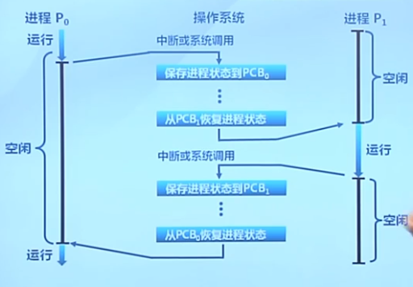
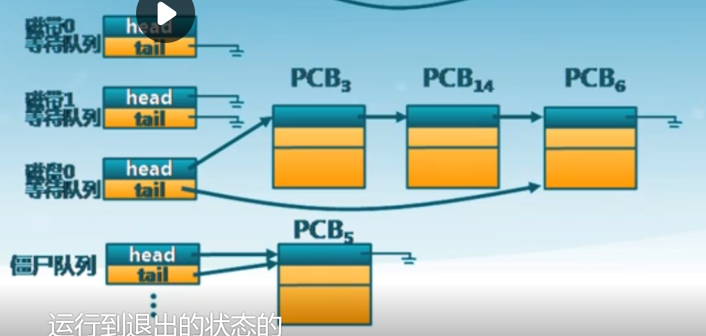
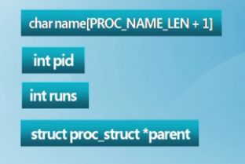
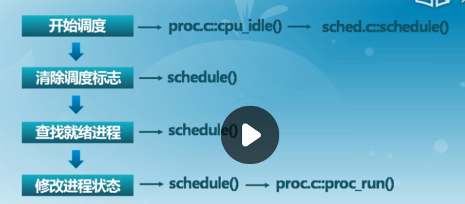
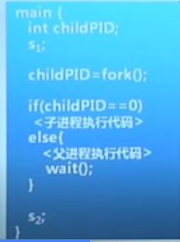
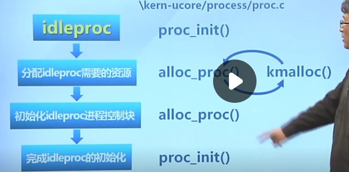

## 1.进程切换

又称为上下文切换

* 暂停当前运行进程,从运行状态变成其他状态
* 调度另一个进程从就绪状态变成运行状态

### 要求

切换前,保存进程上下文
切换后,恢复进程上下文
快速切换（进程切换比较频繁，由汇编实现）

### 进程生命周期的信息

* 寄存器(PC, SP, ..）
* CPU状态
* 内存地址空间



### 进程控制块PCB

内核的进程状态记录

* 内核为每个进程维护了对应的进程控制块PCB
* 内核将相同状态的进程的PCB放置在同一队列

就绪队列


I/O等待队列



不同设备：磁带0、磁带1、磁盘0

运行到退出状态：僵尸队列

### ucore的进程控制块：proc_struct

```c++
// /kern/process/proc.h
struct proc_struct {
    enum proc_state state;                      // 进程的状态 Process state
    int pid;                                    // 线程ID Process ID
    int runs;                                   // 进程的运行时间 the running times of Proces
    uintptr_t kstack;                           // 进程的内核堆栈 Process kernel stack
    volatile bool need_resched;                 // 是否可以调度 bool value: need to be rescheduled to release CPU?
    struct proc_struct *parent;                 // 父进程是谁 the parent process
    struct mm_struct *mm;                       // 进程内存管理的数据结构 Process's memory management field
    struct context context;                     // 线程保护的上下文现场 Switch here to run process
    struct trapframe *tf;                       // 线程保护的和中断保护现场 Trap frame for current interrupt
    uintptr_t cr3;                              // 页表的起始地址 CR3 register: the base addr of Page Directroy Table(PDT)
    uint32_t flags;                             // CPU状态寄存器的相关信息 Process flag
    char name[PROC_NAME_LEN + 1];               // 可执行文件的进程的名字 Process name
    list_entry_t list_link;                     // 进程的链表 Process link list 
    list_entry_t hash_link;                     // 进程的哈希表 Process hash list
};
```


1.进程的标识信息



哪个可执行文件、id、父进程

2.进程的状态信息


CPU状态寄存器的相关信息

地址空间的起头位置，第一级页表的地址地址

进程的状态

它是否允许调度

3.进程所占用的资源


占用的内核堆栈

占用的存储资源、所有分配的资源组织成相关数据结构MM

4.保护现场使用的


使用：中断和进程切换

5.当前进程处于的队列


### ucore的内存地址空间结构：mm_struct

```c++
// /kern/mm/vmm.h

// the control struct for a set of vma using the same PDT
struct mm_struct {
    list_entry_t mmap_list;        // 映射的链表 linear list link which sorted by start addr of vma
    struct vma_struct *mmap_cache; // current accessed vma, used for speed purpose
    pde_t *pgdir;                  // 第一级页表的起始地址的指针 the PDT of these vma
    int map_count;                 // 如果有共享，共享了几次（引用次数） the count of these vma
    void *sm_priv;                 // 如果有跟外存之间的置换，置换相关的数据结构 the private data for swap manager
};


```

### ucore里的进程队列

双向链表


如果链表很长，检索的开销大，加入hash list，加以级哈希队列，哈希值相同的，再组成相应的自己的队列





## 2.进程创建

操作系统提供给用户的一个系统调用

### Windows

windows进程创建API : CreateProcess(filename)
创建时关闭所有在子进程里的文件描述符：CreateProcess(filename, CLOSE_FD)
创建时改变子进程的环境：CreateProcess(filename, CLOSE_FD, new_envp)
等等

### Unix

Unix进程创建系统调用：fork/exec（两种方式，一种出来一个新的，一种相当于替换当前的）

#### fork

fork()把一个进程复制成两个进程：parent(old PID)、child(new PID)

fork()创建一个**继承**的子进程

* 复制父进程的所有**变量和内存**
* 复制父进程的所有**CPU寄存器**(有一个寄存器例外,区别父进程和子进程id的不一样)

##### 返回值

* 子进程的fork()返回
* 父进程的fork()返回子进程标识符

fork( 返回值可方便后续使用,子进程可使用getpid()获取PID



在执行到s1的时候，只有一个进程在执行，执行完fork()进程之后，出现了两个进程，接着往下走的时候，父进程进入<父进程执行代码>，子进程进入<子进程执行代码>分别执行

多次fork：一变二，二变四。。。

功能：准确的复制，给一个新的ID，把它放到就绪队列里面

fork开销大

#### vfork()

创建进程时,不再创建一个同样的内存映像
一些时候称为轻量级fork()
子进程应该几乎立即调用exec()
现在使用Copy on Write（COW）技术，用的时候，才复制

#### exec

exec()用新程序来重写当前进程：PID没有改变

### 空闲进程的创建



## 3.进程加载

### 程序加载和执行系统调用exec()

* 允许进程“加载”一个完全不同的程序，并从main开始执行(即_ start)
* 允许进程加载时指定启动参数(argc, argv)

### exec调用成功时

* 它是相同的进程... 
* 但是运行了不同的程序

代码段、堆栈和堆(heap)等完全重写

### ucore中exec()的实现

分为三个函数`sys_exec()`、`do_execve()`、`load_icode()`

`sys_exec()`：获取相应的参数

`do_execve()`：核心加载功能

`load_icode()`：识别你的可执行文件的格式并且在内存里加载相对应的段，然后开始执行

## 4.进程等待与退出

### 进程等待子进程

wait()系统调用用于父进程等待子进程的结束

* 子进程结束时通过exit()向父进程返回一个值

* 父进程通过wait()接受并处理返回值

### wait()

系统调用的功能

* 子进程存活时,父进程进入等待状态 ,等待子进程的返回结果
  		当某子进程调用exit()时，唤醒父进程,将exit()返回值作为父进程中wait的返回值**【先wait后exit的情况】**

* 有僵尸子进程等待时, wait()立即返回其中一一个值**【先exit后wait的情况】**

* 无子进程存活是，wait立刻返回

### exit()

* 进程的有序终止
* 进程结束执行时调用exit() ,完成进程资源回收

**系统调用的功能**

* 将调用参数作为进程的“结果
* 关闭所有打开的文件等占用资源
* 释放内存
* 释放大部分进程相关的内候数据结构
* 检查是否父进程是存活着的
             如存活,保留结果的值直到父进程需要它,进入僵尸( zombie/defunct )状态
             如果没有，它释放所有的数据结构，进程结果
* 清理所有等待的僵尸进程

### 进程终止是最终的垃圾收集(资源回收)

### 其他进程控制系统调用
#### 优先级控制

* nice()指定进程的**初始优先级**
* Unix系统中进程优先级会随执行时间而衰减

#### 进程调试支持

ptrace()允许一个进程控制另一个进程的执行
设置断点和查看寄存器等

#### 定时

sleep()可以让进程在定时器的等待队列中等待指定的时间

