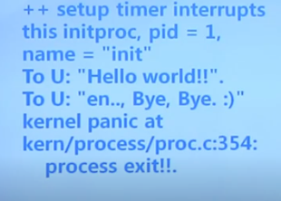
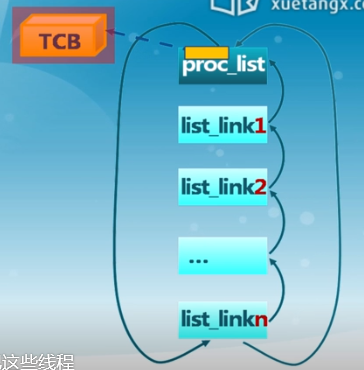
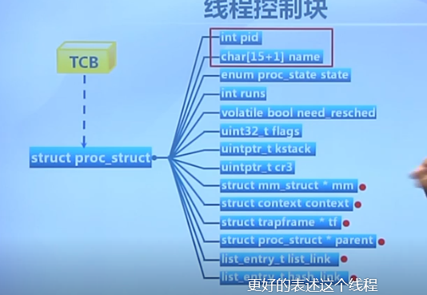
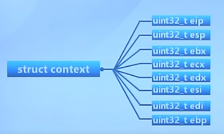
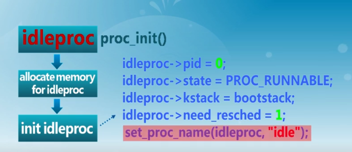
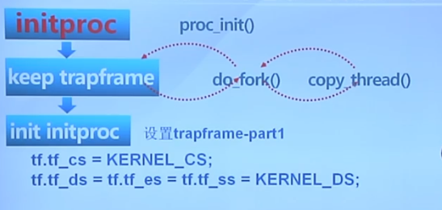
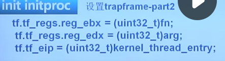
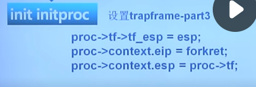
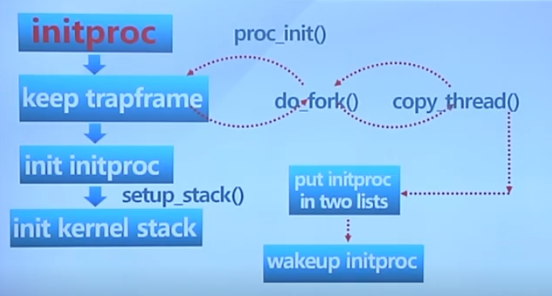
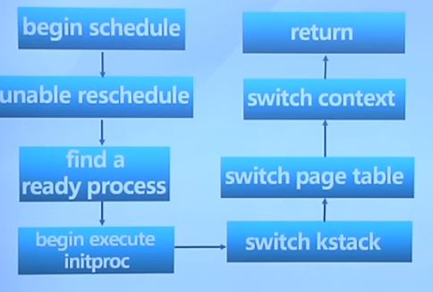

# 实验四 内核线程管理

## 1.总体介绍

TCB：线程控制块（thread control block）

PCB：进程控制块


lab1：建立中断机制，跟外设打交道

lab2：管理物理内存

lab3：管理虚拟内存


练习1 :分配并初始化一个进程控制块
练习2 :为新创建的内核线程分配资源
练习3 :理解如何完成进程切换

结果：




### 流程概述

#### 定义关键数据结构

* 线程控制块
* 线程控制块列表



#### 环境初始化并执行内核线程

* ...虚拟内存初始化
* 内核线程初始化
* 创建内核线程
* 切换到内核线程
* initproc内核线程输出字符串

## 2.关键数据结构



```
pid									线程id
char[15+1] name						线程名字
跟线程标识有关的信息
```

```
enum proc_state state				当前状态（就绪、运行、等待）
int runs							是否需要调度
volatile bool need_resched
uint32_t flags
运行时跟调度相关的一些管理控制的信息
```

```
uintptr_t kstack					内核堆栈
uintptr_t cr3
struct mm_struct * mm
内存管理相关
```

>线程控制块mm_struct
>
>管理线程或者进程所需要的内存空间的
>
>每一个合法的进程内存块用vma表示

```
struct context context 进程或者线程的上下文
struct trapframe * tf
```

>上下文就是进程运行的环境，一堆寄存器
>
>切换上下文就是切换这些寄存器的内容
>
>

trapframe就是保存了被打断（中断或者异常）的进程或者现场它当前的一个状态

````
struct proc_struct * parent 谁创建了线程
线程控制块的链表
list_entry_t list_link
list_entry_t hash_link
````

## 3.执行流程

### 创建第0个内核线程

0：表示首个

第0个内核线程，叫idleproc，代表ucore os来完成一系列的管理工作，包括后面的完成的对内核线程init proc创建和调度执行过程，代表ucore os一个管理




### 创建第1个内核线程



代码和数据都是在kernel里面的



fn是实际的入口地址

arg是设置跟fn相关的一些参数

kernel_thread_entry简单的初始化工作



forkret主要完成对返回中断一个处理过程，最后执行iret，iret根据trap-frame里面设置的信息来跳到init proc这个内核线程入口地址执行（中断的恢复执行过程）



### 执行第一个内核进程

因为创建的时候是在调度，所以要先退出来

page table（内核还是用户，lab4里面暂时没有意义）地址空间



## 4.实际操作

proc.c里面的proc_init函数

设置idle_proc，并进一步去创建init_proc,

do_fork函数

完成具体的，特别是针对init_proc内部线程控制块的初始化工作


cpu_idle就是去查找当期这个idle_proc它是不是need reschedule