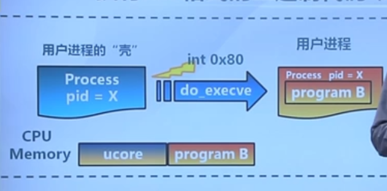

# 用户进程管理

## 总体介绍


### 目标

* 了解第一个用户进程创建过程
* 了解进程管理的实现机制
* 了解系统调用框架的实现机制

### 练习

* 加载应用程序并执行
* 父进程复制自己的内存空间给子进程
* 分析系统调用和进程管理的实现

### 流程概述

建立用户代码/数据段 => 创建内核线程 => 创建用户进程“壳" =>  填写用户进程"肉" => 执行用户进程 => 完成系统调用 => 结束用户进程

## 进程的内存布局

内核虚拟内存布局


用户进程虚拟内存布局


User STAB Data存放的是调试信息

Invalid Memory是非法区域

### 执行ELF格式的二进制代码



ucore和program B放在一起，被加载到了内存中去，创建一个用户进程的“壳”，调用do_evecve函数，把program B放入到用户进程中去执行。

### do_evecve函数的实现

功能：执行ELF格式的二进制代码

把以前的内存给清理掉，但是保留原来的pid，把里面的内容换成自己的。

把进程内存管理的那块清空，对应的页表清空

填入新的内存


```c++
// do_execve - call exit_mmap(mm)&put_pgdir(mm) to reclaim memory space of current process
//           - call load_icode to setup new memory space accroding binary prog.
int
do_execve(const char *name, size_t len, unsigned char *binary, size_t size) {
    struct mm_struct *mm = current->mm;
    if (!user_mem_check(mm, (uintptr_t)name, len, 0)) {
        return -E_INVAL;
    }
    if (len > PROC_NAME_LEN) {
        len = PROC_NAME_LEN;
    }

    char local_name[PROC_NAME_LEN + 1];
    memset(local_name, 0, sizeof(local_name));
    memcpy(local_name, name, len);

    if (mm != NULL) {
        lcr3(boot_cr3);
        if (mm_count_dec(mm) == 0) {
            exit_mmap(mm);//清空原来的内存资源
            put_pgdir(mm);
            mm_destroy(mm);
        }
        current->mm = NULL;
    }
    int ret;
    if ((ret = load_icode(binary, size)) != 0) {//填入新的内存资源
        goto execve_exit;
    }
    set_proc_name(current, local_name);
    return 0;

execve_exit:
    do_exit(ret);
    panic("already exit: %e.\n", ret);
}

```

#### load_icode函数

功能：同样的进程，把内容作了完全的替换


all-zero memory：一些bss段，段里面的数据（初始化的一些数据）需要清空

## load_icode的实现

> load_icode中的trapframe的实现

trapframe：实现特权级的转变，从kernel空间到用户空间


构造一个合理的trapframe，进行iret后，可以跳到用户空间去执行

进程有两个栈，一个内核栈，一个用户栈，在用户态使用用户stack，在内核态使用内核stack

## 进程复制


主要靠fork函数实现

`int do_fork(uint32_t clone_flags, uintptr_t stack, struct trapframe *tf)`

三个参数，第一个和内核memory相关的，决定了我们如何完成内存空间管理的一个拷贝；后面两个跟用户堆栈stack相关的，跟trapframe相关

* copy_mm()：为新进程创建新虚拟空间

* copy_range()：拷贝父进程的内存到新进程

注意：可能会失败，需要做相应的处理

**设置trapframe&context**

拷贝父进程的trapframe到新进程
eax= 0 (系统调用的返回值)
esp = (the parameter)
eip = forkret
copy_ thread()完成上述工作
注意:不能失败

添加新的proc_ struct到proc. list，唤醒新进程(用wakeup_ proc()


父进程返回的是子进程的pid，子进程返回的是0

## 内存管理的copy-on-write机制（challenge）

写时复制技术


对共享地址只能做读写操作，空间设置是只读的


如果进行了写操作，page fault，中断了，在这个点上，两个进程需要有独立的空间了


copy-on-write：在write操作的时候，会完成页表内容的一个复制和更新

共享和页换入换出可能需要考虑的问题

* copy. range() in pmm.c
  不能copy pages当“ share=true"
*  do_ pgfault() in vmm.c
  在page fault handler中检测COW case
  适时处理page duplications和改变page table entry
* dup_ mmap() in vmm.c
   改变"bool share=0"为"bool share=1"

