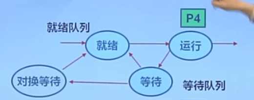

### 5.3连续内存分配

#### 最先匹配

##### 思路

分配n个字节，使用**第一个可用**的空间比n大的空闲块。

##### 原理&实现

空闲分区列表按**地址顺序**排序
分配过程时,搜索一个合适的分区
释放分区时,检查是否可与临近的空闲分区合并

##### 优点
简单
在高地址空间有大块的空闲分区

##### 缺点
外部碎片
分配大块时较慢

#### 最佳匹配

##### 思路

分配n字节分区时，查找并使用不小于n的最小空闲分区

##### 原理&实现

空闲分区列表按照**大小排序**
分配时，查找一个合适的分区
释放时，查找并且合并临近的空闲分区(如果找到)

##### 优点
大部分分配的尺寸较小时，效果很好

* 可避免大的空闲分区被拆分
* 可减小外部碎片的大小
* 相对简单

##### 缺点
外部碎片
释放分区较慢
容易产生很多无用的小碎片

### 最差匹配

##### 思路

分配n字节,使用尺寸不小于n的最大空闲分区
##### 原理&实现
空闲分区列表按由**大到小排序**
分配时，选最大的分区
释放时,检查是否可与临近的空闲分区合并，进行可能的合并，
并调整空闲分区列表顺序

##### 优点

中等大小的分配较多时,效果最好
D避免出现太多的小碎片

##### 缺点

释放分区较慢
外部碎片
容易破坏大的空闲分区,因此后续难以分配大的分区

### 5.4 碎片整理

#### 原理

通过**调整**进程占用的**分区位置**来减少或避免分区碎片

#### 方法一：碎片紧凑

通过移动分配给进程的内存分区，以合并外部碎片
碎片紧凑的条件

* 所有的应用程序可动态重定位

#### 方法二：分区对换

通过抢占并回收处于等待状态进程的分区，以增大可用内存空间

### 5.5 伙伴系统（Buddy System）

整个可分配的分区大小2^U（2的幂次）
需要的分区大小为2^（U-1） < S≤2^U时,把整个块分配给该进程,否则，切一半;

#### 实现

##### 数据结构

空闲块按**大小**（一维）和**起始地址**（二维）组织成二维数组
初始状态:只有一个大小为2^U的空闲块

##### 分配过程

由小到大在空闲块数组中找**最小的可用空闲块**
如空闲块过大，对可用空闲块进行二等分,直到得到合适的可用空闲块

##### 释放过程

把释放的块放入空闲块数组
合并满足合并条件的空闲块

##### 合并条件

大小相同2^i
地址相邻
起始地址较小的块的起始地址必须是2^(i+1)的倍数