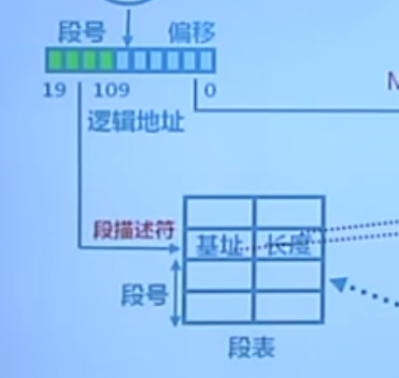
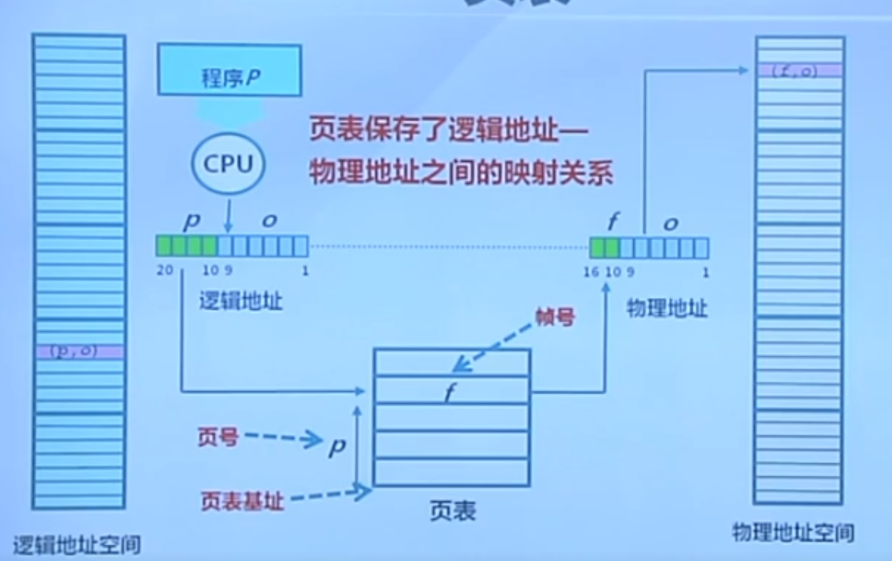
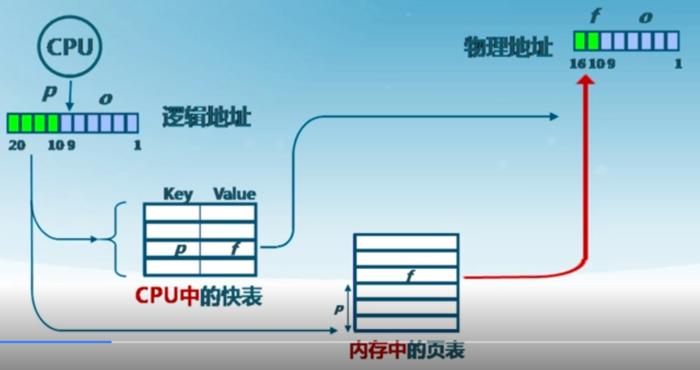
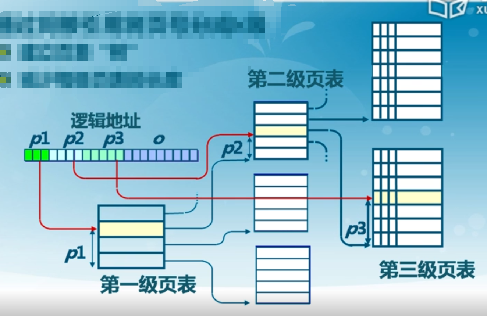
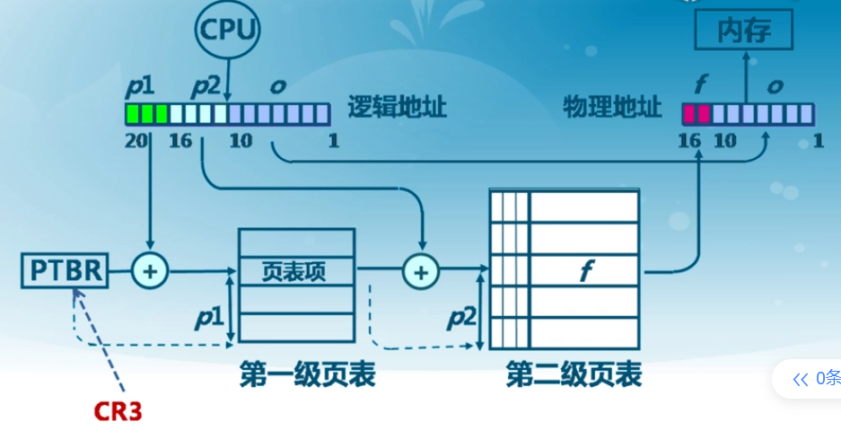
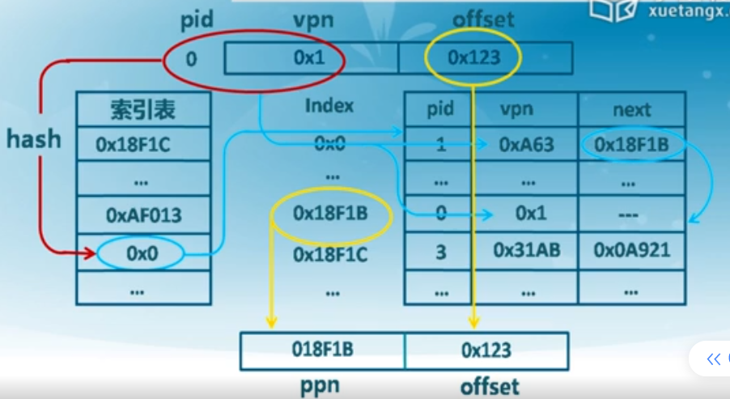
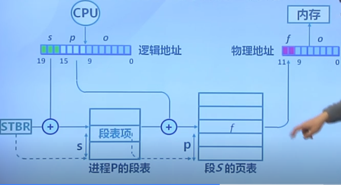
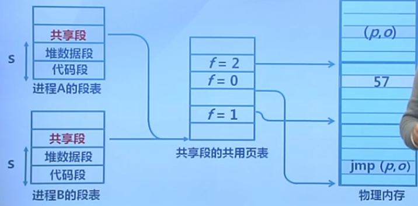

### 6.1 非连续内存分配的需求背景

#### 连续分配的缺点

分配给程序的物理内存必须连续
存在外碎片和内碎片
内存分配的**动态修改困难**
内存利用率较低

#### 非连续分配的设计目标 

提高内存利用效率和管理灵活性

**特点：**

允许一个程序使用非连续的物理地址空间
允许**共享代码与数据**
支持**动态加载**和**动态链接**

#### 非连续分配的硬件辅助机制

如何选择非连续分配中的内存分块大小？

* 段式存储管理( segmentation )比较大
* 页式存储管理( paging )比较小

### 6.2段式存储管理

#### 进程的段地址空间由多个段组成

* 主代码段
* 子模块代码段
* 公用库代码段
* 堆栈段(stack)
* 堆数据(heap)
* 初始化数据段
* 符号表等

#### 段的概念 

段表示访问方式和存储数据等**属性相同**的一段地址空间
对应一个连续的内存“块”
若干个段组成进程逻辑地址空间

#### 段访问 

逻辑地址由二元组`(s, addr)`表示

* s - 段号
* `addr` - 段内偏移

有了段号，到段描述符里面找到基址

### 6.3页式存储管理

#### 页帧(帧、 物理页面，Frame, Page Frame )

把**物理**地址空间划分为大小相同的基本分配单位
2的n次方，如512, 4096, 8192

地址表示：（p,o）

#### 页面(页、 逻辑页面，Page )

把**逻辑**地址空间也划分为相同大小基本 分配单位
**帧和页**的**大小**必须是**相同**的

地址表示：（f,o）

从逻辑页号到物理帧号的转换：页表

根据p页号，在页表里面找到帧号

### 6.4 页表概述

每个进程都有一个页表

* 每个**页面**对应一个**页表项**
* 随进程运行状态而**动态**变化
* **页表基址寄存器**(`PTBR: PageTable Base Register`)

#### 页表项组成

帧号:f
页表项标志

* 存在位(resident bit)
* 修改位(dirty bit)
* 引用位(clock/reference bit)

#### 内存访问性能问题

访问一个内存单元需要2次内存访问

* 第一次访问:获取页表项
* 第二次访问 :访问数据

####  页表大小问题 

页表可能非常大

#### 如何处理?

* 缓存( Caching )——快表

由于我们在程序执行的时候，访问的数据、访问的代码，它都具有一定的相邻性，把你得到的页表项缓存下来，我下一次的时候利用这缓存，极大的可能性，我是可以直接访问到物理内存的，这样的话，就可以把你的访问次数减下来

* 间接( Indirection )访问——多级页表

是说我的页表很大，一个很长的表，那很麻烦，那我们对付这种长的问题的做法是什么呢，把它切段，好，间接访问，先找它是在哪个子表里头，然后在子表里再去找，好，这就是我们说的间接访问，这种间接访问，对应过来呢，就是多级页表。

### 6.5 快表和多级页表

#### 快表（Translation Look-aside Buffer，TLB）

缓存近期访问的页表项

* `TLB`使用**关联存储**(associative memory)实现，具备快速访问性能
* 如果`TLB`命中,物理页号可以很快被获取
* 如果`TLB`未命中，对应的表项被更新到`TLB`中

#### 多级页表

通过间接引用将页号分成k级

* 建立页表“树”
* 减少每级页表的长度
* 访问次数`k+1`

### 6.6 反置页表

#### 大地址空间问题

对于大地址空间(64-bits)系统，多级页表变得繁琐
比如:5级页表
逻辑(虛拟)地址空间增长速度快于物理地址空间

#### 页寄存器和反置页面的思路

* **不**让页表与**逻辑**地址空间的大相对应
* 让页表与**物理**地址空间的大小相对应

#### 页寄存器

每个帧（物理的）与一个页寄存器(Page Register)关联，寄存器内容包括:

* 使用位(Residence bit):此帧是否被进程占用
* 占用页号(Occupier): 对应的页号p
* 保护位(Protection bits)访问方式：可读可写

#### 页寄存器示例

* 物理内存大小: 4096`*`4096 = `4K * 4KB`=`16MB`
* 页面大小: 4096 bytes = `4KB` 
* 页帧数: 4096=` 4K`
* 页寄存器使用的空间(假设每个页寄存器占8字节): 8*4096= 32 `Kbytes`
* 页寄存器带来的额外开销:                                `32K/16M` = 0.2% (大约)
* 虚拟内存的大小:任意

#### 优点:

* 页表大小相对于物理内存而言很小
* 页表大小与逻辑地址空间大小无关

#### 缺点:

* 页表信息对调后，需要依据帧号可找页号
* 在页寄存器中搜索逻辑地址中的页号

#### 页寄存器中的地址转换

CPU生成的**逻辑地址**如何**找**对应的**物理地址**?

* 对逻辑地址进行**Hash映射**，以减少搜索范围
* 需要解决可能的冲突

用**快表缓存页表项**后的**页寄存器搜索**步骤

* 对逻辑地址进行Hash变换
* 在**快表**中查找对应**页表项**
* 有**冲突时**遍历**冲突项链表**
* 查找失败时,产生异常

快表的限制

* 快表的容量限制
* 快表的功耗限制(`StrongARM`上快表功耗占27%)

#### 反置页表

基于Hash映射值查找对应页表项中的帧号

* 进程标识与页号的Hash值可能有冲突
* 页表项中包括保护位、修改位、访问位和存在位等标识

第一次，不一样，冲突了，找下一个

### 6.7 段页式存储管理

段式页式相结合

* 段式存储在**内存保护**方面有优势
* 页式存储在**内存利用**和**优化转移到后备存储**方面有优势。

#### 思路

在段式存储管理基础上，给每个段加一级页表

#### 内存共享

通过指向相同的页表基址,实现进程间的段共享

